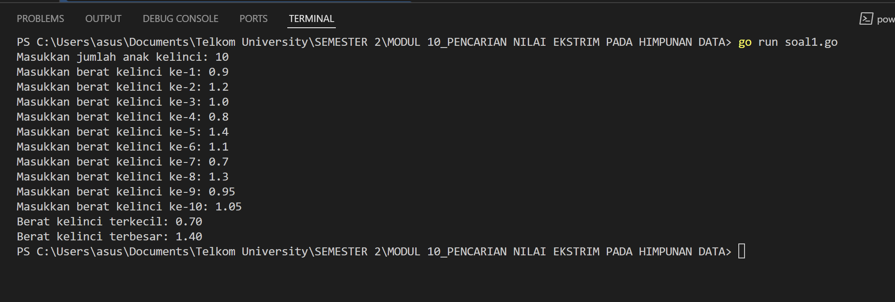
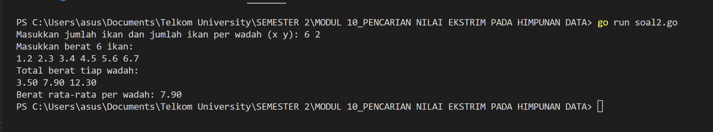
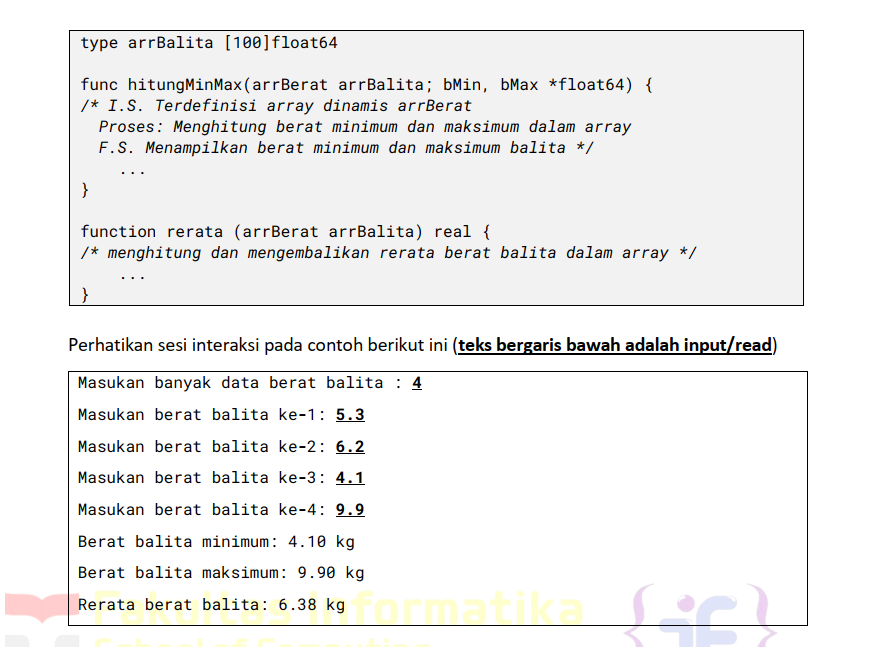
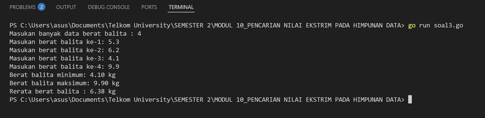

# <h1 align="center">Laporan Praktikum Modul 10 <br> Pencarian Nilai Ekstrim Pada Himpunan Data</h1>

<p align="center">ANISA KEYZA HUSNUL KHATIMAH - 2211102210</p>

  

## Dasar Teori

Pencarian adalah suatu proses yang lazim dilakukan di dalam kehidupan sehari-hari. Contoh  
penggunaannya dalam kehidupan nyata sangat beragam, misalnya pencarian file di dalam  
directory komputer, pencarian suatu teks di dalam sebuah dokumen, pencarian buku pada rak  
buku, dan contoh lainnya. Pertama pada modul ini akan dipelajari salah satu algoritma pencarian  
nilai terkecil atau terbesar pada sekumpulan data, atau biasa disebut pencarian nilai ekstrim.

## Unguided


### No. 1

Sebuah program digunakan untuk mendata berat anak kelinci yang akan dijual ke pasar.  
Program ini menggunakan array dengan kapasitas 1000 untuk menampung data berat anak  
kelinci yang akan dijual.  
Masukan terdiri dari sekumpulan bilangan, yang mana bilangan pertama adalah bilangan  
bulat N yang menyatakan banyaknya anak kelinci yang akan ditimbang beratnya. Selanjutnya  
N bilangan riil berikutnya adalah berat dari anak kelinci yang akan dijual.  
Keluaran terdiri dari dua buah bilangan riil yang menyatakan berat kelinci terkecil dan  
terbesar.

```go
package main

import (
    "fmt"
)

func main() {
    var n int
    var berat [1000]float64
    fmt.Print("Masukkan jumlah anak kelinci: ")
    fmt.Scan(&n)

    // Memasukkan berat anak kelinci
    for i := 0; i < n; i++ {
        fmt.Printf("Masukkan berat kelinci ke-%d: ", i+1)
        fmt.Scan(&berat[i])
    }

    // Inisialisasi nilai awal minimum dan maksimum
    min := berat[0]
    max := berat[0]

    // Menentukan berat terkecil dan terbesar
    for i := 1; i < n; i++ {
        if berat[i] < min {
            min = berat[i]
        }
        if berat[i] > max {
            max = berat[i]
        }
    }

    // Output hasil
    fmt.Printf("Berat kelinci terkecil: %.2f\n", min)
    fmt.Printf("Berat kelinci terbesar: %.2f\n", max)
}
```

> Output
> 

Cara kerja program dapat dijelaskan secara bertahap sebagai berikut:

1. **Inisialisasi dan Input Jumlah Anak Kelinci**  
    Program dimulai dengan meminta pengguna memasukkan sebuah bilangan bulat yang menyatakan jumlah anak kelinci yang akan ditimbang. Nilai ini disimpan dalam variabel `n`.
2. **Inisialisasi Array dan Nilai Awal Minimum & Maksimum**  
    Sebuah array dengan kapasitas maksimum 1000 disiapkan untuk menyimpan berat anak kelinci. Dua variabel tambahan `min` dan `max` diinisialisasi dengan berat dari kelinci pertama yang dimasukkan oleh pengguna.
3. **Proses Input Berat dan Pencarian Minimum-Maksimum**  
    Program kemudian menjalankan perulangan sebanyak `n` kali untuk membaca berat masing-masing anak kelinci. Selama proses input ini berlangsung:
    - Berat setiap kelinci disimpan dalam array.
    - Program memeriksa apakah berat yang baru dimasukkan lebih kecil dari `min` atau lebih besar dari `max`.
    - Jika iya, maka `min` atau `max` akan diperbarui dengan nilai baru tersebut.
4. **Menampilkan Hasil**  
    Setelah seluruh data berat dimasukkan dan diperiksa, program mencetak hasil akhir berupa:
    - Berat terkecil (`min`)
    - Berat terbesar (`max`)


### No. 2

Sebuah program digunakan untuk menentukan tarif ikan yang akan dijual ke pasar. Program  
ini menggunakan array dengan kapasitas 1000 untuk menampung data berat ikan yang akan  
dijual.  
Masukan terdiri dari dua baris, yang mana baris pertama terdiri dari dua bilangan bulat x dan  
y. Bilangan x menyatakan banyaknya ikan yang akan dijual, sedangkan y adalah banyaknya  
ikan yang akan dimasukan ke dalam wadah. Baris kedua terdiri dari sejumlah x bilangan riil  
yang menyatakan banyaknya ikan yang akan dijual.  
Keluaran terdiri dari dua baris. Baris pertama adalah kumpulan bilangan riil yang menyatakan  
total berat ikan di setiap wadah (jumlah wadah tergantung pada nilai x dan y, urutan ikan yang  
dimasukan ke dalam wadah sesuai urutan pada masukan baris ke-2). Baris kedua adalah  
sebuah bilangan riil yang menyatakan berat rata-rata ikan di setiap wadah.

```go
package main

import (
    "fmt"
)

const NMAX = 1000
  
func main() {
    var x, y int
    var beratIkan [NMAX]float64

    // Input jumlah ikan (x) dan jumlah ikan per wadah (y)
    fmt.Print("Masukkan jumlah ikan dan jumlah ikan per wadah (x y): ")
    fmt.Scan(&x, &y)

    // Input berat tiap ikan
    fmt.Printf("Masukkan berat %d ikan:\n", x)
    for i := 0; i < x; i++ {
        fmt.Scan(&beratIkan[i])
    }

    // Hitung jumlah wadah
    jumlahWadah := (x + y - 1) / y // pembulatan ke atas

    // Hitung total berat per wadah
    var wadah [NMAX]float64
    var idx int
    for i := 0; i < jumlahWadah; i++ {
        total := 0.0
        for j := 0; j < y && idx < x; j++ {
            total += beratIkan[idx]
            idx++
        }
        wadah[i] = total
    }

    // Output total berat per wadah
    fmt.Println("Total berat tiap wadah:")
    for i := 0; i < jumlahWadah; i++ {
        fmt.Printf("%.2f ", wadah[i])
    }
    fmt.Println()

    // Hitung dan output rata-rata berat per wadah
    totalSemua := 0.0
    for i := 0; i < jumlahWadah; i++ {
        totalSemua += wadah[i]
    }
    rataRata := totalSemua / float64(jumlahWadah)
    fmt.Printf("Berat rata-rata per wadah: %.2f\n", rataRata)
}
```

> Output
> 

Program ini membaca jumlah ikan dan kapasitas wadah, lalu membaca berat masing-masing ikan. Ikan dimasukkan ke dalam wadah secara berurutan sebanyak `y` ekor per wadah. Setelah semua ikan dibagi ke dalam wadah, program mencetak total berat tiap wadah dan menghitung rata-rata berat per wadah.

### No. 3

Pos Pelayanan Terpadu (posyandu) sebagai tempat pelayanan kesehatan perlu mencatat data  
berat balita (dalam kg). Petugas akan memasukkan data tersebut ke dalam array. Dari data  
yang diperoleh akan dicari berat balita terkecil, terbesar, dan reratanya.  
Buatlah program dengan spesifikasi subprogram sebagai berikut:

> 

```go
package main

import (
    "fmt"
)

type arrBalita [100]float64  

// Fungsi untuk menghitung nilai minimum dan maksimum
func hitungMinMax(arr arrBalita, n int, bMin *float64, bMax *float64) {
    *bMin = arr[0]
    *bMax = arr[0]

    for i := 1; i < n; i++ {
        if arr[i] < *bMin {
            *bMin = arr[i]
        }
        if arr[i] > *bMax {
            *bMax = arr[i]
        }
    }
}

// Fungsi untuk menghitung rata-rata
func rerata(arr arrBalita, n int) float64 {
    var total float64 = 0.0
    for i := 0; i < n; i++ {
        total += arr[i]
    }
    return total / float64(n)
}

func main() {
    var data arrBalita
    var n int
    var min, max float64

    fmt.Print("Masukan banyak data berat balita : ")
    fmt.Scan(&n)

    for i := 0; i < n; i++ {
        fmt.Printf("Masukan berat balita ke-%d: ", i+1)
        fmt.Scan(&data[i])
    }

    hitungMinMax(data, n, &min, &max)
    rata := rerata(data, n)

    fmt.Printf("Berat balita minimum: %.2f kg\n", min)
    fmt.Printf("Berat balita maksimum: %.2f kg\n", max)
    fmt.Printf("Rerata berat balita : %.2f kg\n", rata)
}
```

> Output
> 

Program ini menerima input berat balita ke dalam array bertipe `arrBalita`. Dua subprogram digunakan:
- `hitungMinMax` untuk menghitung berat minimum dan maksimum.
- `rerata` untuk menghitung nilai rata-rata dari seluruh berat.
Kemudian hasil dari ketiga nilai tersebut ditampilkan sebagai output.