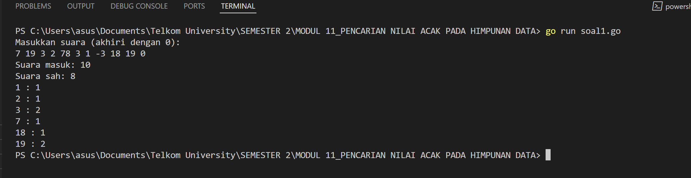
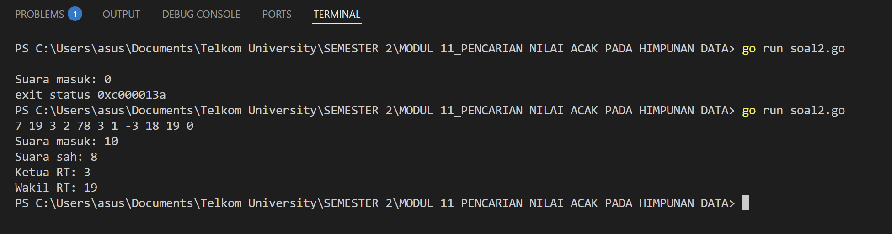
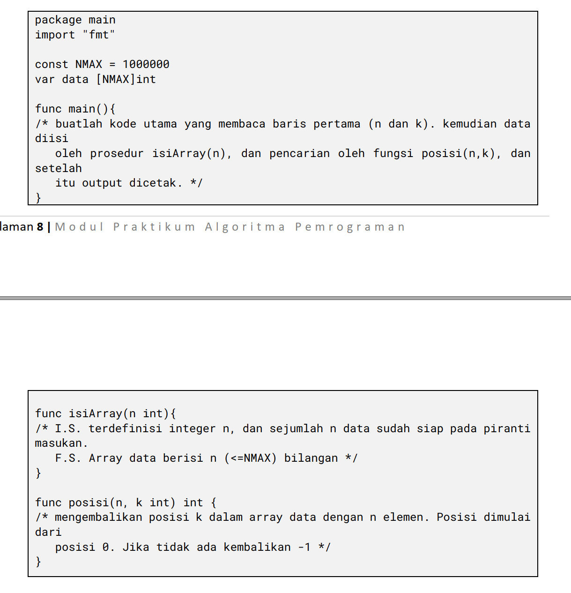
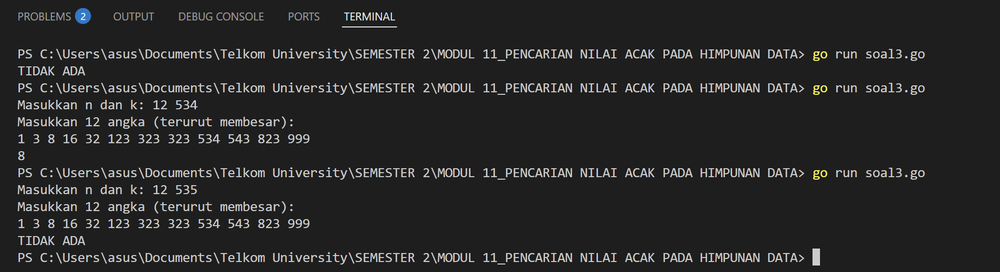

# <h1 align="center">Laporan Praktikum Modul 11 <br> Pencarian Nilai Acak Pada Himpunan Data</h1>

<p align="center">ANISA KEYZA HUSNUL KHATIMAH - 2211102210</p>

  

## Dasar Teori

"Pencarian nilai acak pada himpunan data" adalah proses untuk **menemukan apakah suatu nilai tertentu yang diambil secara acak (random) terdapat dalam kumpulan data yang telah tersedia**. Himpunan data ini bisa berupa array, slice, list, atau struktur data lainnya. Pencarian nilai acak dalam data bermanfaat untuk simulasi, validasi, atau pengambilan keputusan berbasis probabilitas. Proses ini menggabungkan teknik dasar pencarian dengan elemen ketidakpastian dari angka acak.

## Unguided


### No. 1

Pada pemilihan ketua RT yang baru saja berlangsung, terdapat 20 calon ketua yang bertanding  
memperebutkan suara warga. Perhitungan suara dapat segera dilakukan karena warga cukup  
mengisi formulir dengan nomor dari calon ketua RT yang dipilihnya. Seperti biasa, selalu ada  
pengisian yang tidak tepat atau dengan nomor pilihan di luar yang tersedia, sehingga data juga  
harus divalidasi. Tugas Anda untuk membuat program mencari siapa yang memenangkan  
pemilihan ketua RT.
Buatlah program pilkart yang akan membaca, memvalidasi, dan menghitung suara yang  
diberikan dalam pemilihan ketua RT tersebut.
Masukan hanya satu baris data saja, berisi bilangan bulat valid yang kadang tersisipi dengan  
data tidak valid. Data valid adalah integer dengan nilai di antara 1 s.d. 20 (inklusif). Data  
berakhir jika ditemukan sebuah bilangan dengan nilai 0.  
Keluaran dimulai dengan baris berisi jumlah data suara yang terbaca, diikuti baris yang berisi  
berapa banyak suara yang valid. Kemudian sejumlah baris yang mencetak data para calon apa  
saja yang mendapatkan suara.

```go
package main

import (
    "fmt"
)

func main() {
    const MAX_CANDIDATE = 20
    var suara [100]int               // Menampung semua suara masuk
    var hasil [MAX_CANDIDATE + 1]int // Untuk menyimpan jumlah suara tiap calon (index 1 s.d. 20)

    // Input suara (dapat dimodifikasi untuk membaca dari user atau file jika diperlukan)
    fmt.Println("Masukkan suara (akhiri dengan 0):")
    n := 0
    for {
        var s int
        fmt.Scan(&s)
        if s == 0 {
            break
        }
        suara[n] = s
        n++
    }

    totalMasuk := n
    totalSah := 0

    // Validasi dan penghitungan suara sah
    for i := 0; i < totalMasuk; i++ {
        if suara[i] >= 1 && suara[i] <= MAX_CANDIDATE {
            hasil[suara[i]]++
            totalSah++
        }
    }

    // Output
    fmt.Printf("Suara masuk: %d\n", totalMasuk)
    fmt.Printf("Suara sah: %d\n", totalSah)
    for i := 1; i <= MAX_CANDIDATE; i++ {
        if hasil[i] > 0 {
            fmt.Printf("%d : %d\n", i, hasil[i])
        }
    }
}
```

> Output
> 

rogram _pilkart_ dirancang untuk membaca dan menghitung suara dalam pemilihan ketua RT. Program ini bekerja dengan membaca satu baris data berupa angka-angka yang mewakili nomor calon ketua RT yang dipilih warga. Data akan diproses hingga ditemukan angka `0` yang menandakan akhir dari input. Setiap angka yang dibaca sebelum `0` dihitung sebagai suara masuk.

Setelah semua data dibaca, program memvalidasi suara berdasarkan ketentuan bahwa hanya angka dari 1 hingga 20 yang dianggap sebagai suara sah. Angka di luar rentang tersebut akan diabaikan dan tidak ikut dihitung sebagai suara sah.

Selanjutnya, program menghitung dan mencetak total suara masuk, jumlah suara yang sah, dan distribusi suara yang diperoleh setiap calon ketua RT. Data calon yang tidak mendapatkan suara tidak akan ditampilkan.

Sebagai contoh, jika input berupa:  
`7 19 3 2 78 3 1 -3 18 19 0`,  
maka program akan mencatat bahwa ada **10 suara masuk**, dengan **8 suara sah**, dan menampilkan hasil perolehan suara sebagai berikut:  
Calon nomor 1 mendapatkan 1 suara, nomor 2 mendapatkan 1 suara, nomor 3 mendapatkan 2 suara, dan seterusnya.


### No. 2

Berdasarkan program sebelumnya, buat program pilkart yang mencari siapa pemenang  
pemilihan ketua RT. Sekaligus juga ditentukan bahwa wakil ketua RT adalah calon yang  
mendapatkan suara terbanyak kedua. Jika beberapa calon mendapatkan suara terbanyak yang  
Halaman 8 | M o d u l P r a k t i k u m A l g o r i t m a P e m r o g r a m a n  
sama, ketua terpilih adalah dengan nomor peserta yang paling kecil dan wakilnya dengan  
nomor peserta terkecil berikutnya.  
Masukan hanya satu baris data saja, berisi bilangan bulat valid yang kadang tersisipi dengan  
data tidak valid. Data valid adalah bilangan bulat dengan nilai di antara 1 s.d. 20 (inklusif). Data  
berakhir jika ditemukan sebuah bilangan dengan nilai 0.  
Keluaran dimulai dengan baris berisi jumlah data suara yang terbaca, diikuti baris yang berisi  
berapa banyak suara yang valid. Kemudian tercetak calon nomor berapa saja yang menjadi  
pasangan ketua RT dan wakil ketua RT yang baru.

```go
package main

import (
    "fmt"
    "sort"
)

func main() {
    var input int
    var suaraMasuk int
    suara := make([]int, 21) // indeks 1-20 valid

    for {
        fmt.Scan(&input)
        if input == 0 {
            break
        }
        suaraMasuk++
        if input >= 1 && input <= 20 {
            suara[input]++
        }
    }

    // Hitung suara sah
    suaraSah := 0
    for i := 1; i <= 20; i++ {
        suaraSah += suara[i]
    }

    // Menentukan ketua dan wakil
    type kandidat struct {
        nomor int
        suara int
    }
    var hasil []kandidat
    for i := 1; i <= 20; i++ {
        if suara[i] > 0 {
            hasil = append(hasil, kandidat{i, suara[i]})
        }
    }

    // Urutkan berdasarkan suara terbanyak, jika sama urutkan berdasarkan nomor terkecil
    sort.Slice(hasil, func(i, j int) bool {
        if hasil[i].suara == hasil[j].suara {
            return hasil[i].nomor < hasil[j].nomor
        }
        return hasil[i].suara > hasil[j].suara
    })

    // Cetak hasil
    fmt.Printf("Suara masuk: %d\n", suaraMasuk)
    fmt.Printf("Suara sah: %d\n", suaraSah)
    if len(hasil) >= 1 {
        fmt.Printf("Ketua RT: %d\n", hasil[0].nomor)
    }
    if len(hasil) >= 2 {
        fmt.Printf("Wakil RT: %d\n", hasil[1].nomor)
    }
}
```

> Output
> 

Program membaca semua suara hingga ditemukan angka `0`. Kemudian memvalidasi angka (hanya 1–20 yang sah), lalu menghitung jumlah suara sah dan menentukan ketua serta wakil berdasarkan suara terbanyak. Jika ada jumlah suara yang sama, nomor calon yang lebih kecil diutamakan.


### No. 3

Diberikan n data integer positif dalam keadaan terurut membesar dan sebuah integer lain k,  
apakah bilangan k tersebut ada dalam daftar bilangan yang diberikan? Jika ya, berikan  
indeksnya, jika tidak sebutkan "TIDAK ADA".

Masukan terdiri dari dua baris. Baris pertama berisi dua buah integer positif, yaitu n dan k. n  
menyatakan banyaknya data, dimana 1 < n <= 1000000. k adalah bilangan yang ingin dicari.  
Baris kedua berisi n buah data integer positif yang sudah terurut membesar.  

Keluaran terdiri dari satu baris saja, yaitu sebuah bilangan yang menyatakan posisi data yang  
dicari (k) dalam kumpulan data yang diberikan. Posisi data dihitung dimulai dari angka 0. Atau  
memberikan keluaran "TIDAK ADA" jika data k tersebut tidak ditemukan dalam kumpulan.

Program yang dibangun harus menggunakan subprogram dengan mengikuti kerangka yang  
sudah diberikan berikut ini.

> 

```go
package main

import (
    "fmt"
)

const NMAX = 1000000  

var data [NMAX]int

func main() {
    var n, k int

    // Baca jumlah data dan nilai yang ingin dicari
    fmt.Print("Masukkan n dan k: ")
    fmt.Scan(&n, &k)

    // Baca array data
    fmt.Println("Masukkan", n, "angka (terurut membesar):")
    isiArray(n)

    // Cari posisi
    pos := posisi(n, k)

    // Output hasil
    if pos == -1 {
        fmt.Println("TIDAK ADA")
    } else {
        fmt.Println(pos)
    }
}

// Mengisi array sebanyak n data
func isiArray(n int) {
    for i := 0; i < n; i++ {
        fmt.Scan(&data[i])
    }
}

// Mengembalikan posisi elemen k dalam array (pakai binary search)
func posisi(n, k int) int {
    low := 0
    high := n - 1

    for low <= high {
        mid := (low + high) / 2
        if data[mid] == k {
            return mid
        } else if data[mid] < k {
            low = mid + 1
        } else {
            high = mid - 1
        }
    }
    return -1
}
```

> Output
> 

Program ini bertujuan untuk mencari posisi sebuah bilangan bulat positif `k` dalam sekumpulan data bilangan bulat positif yang telah terurut secara membesar. Proses pencarian ini dilakukan menggunakan metode **pencarian biner (binary search)** agar lebih efisien dibandingkan pencarian linear biasa.
##### **Deskripsi Masukan**

Program menerima dua jenis masukan dari pengguna:
1. Dua bilangan bulat `n` dan `k`, di mana `n` menyatakan jumlah data dalam kumpulan, dan `k` adalah bilangan yang ingin dicari posisinya.
2. Sebanyak `n` bilangan bulat positif yang telah diurutkan secara menaik (ascending).

Nilai `n` dibatasi antara 1 hingga 1.000.000, sedangkan semua bilangan dalam kumpulan data harus positif dan telah terurut dari kecil ke besar.

##### **Struktur Program**

Program ini dibagi menjadi tiga bagian utama:
1. **Fungsi `main()`**
    - Membaca masukan pertama (`n` dan `k`).
    - Memanggil prosedur `isiArray(n)` untuk membaca data ke dalam array.
    - Memanggil fungsi `posisi(n, k)` untuk mencari posisi bilangan `k`.
    - Menampilkan hasil pencarian, yaitu indeks posisi dari `k` atau menampilkan `"TIDAK ADA"` jika `k` tidak ditemukan.
2. **Prosedur `isiArray(n int)`**
    - Membaca sebanyak `n` bilangan dan menyimpannya dalam array global `data`.
    - Diasumsikan data yang dibaca telah dalam keadaan terurut.
3. **Fungsi `posisi(n, k int) int`**
    - Melakukan pencarian biner (binary search) untuk menemukan indeks posisi dari `k`.
    - Jika ditemukan, fungsi akan mengembalikan posisi indeksnya (dimulai dari 0).
    - Jika tidak ditemukan, fungsi akan mengembalikan nilai `-1`.

##### **Deskripsi Keluaran**

Keluaran program terdiri dari:
- Posisi indeks dari bilangan `k` jika ditemukan, atau
- Teks `"TIDAK ADA"` jika `k` tidak ditemukan dalam data.