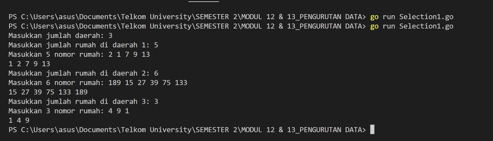
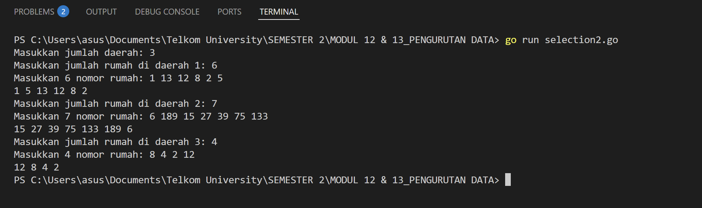
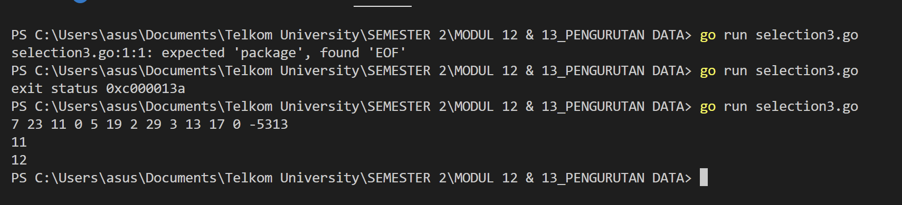
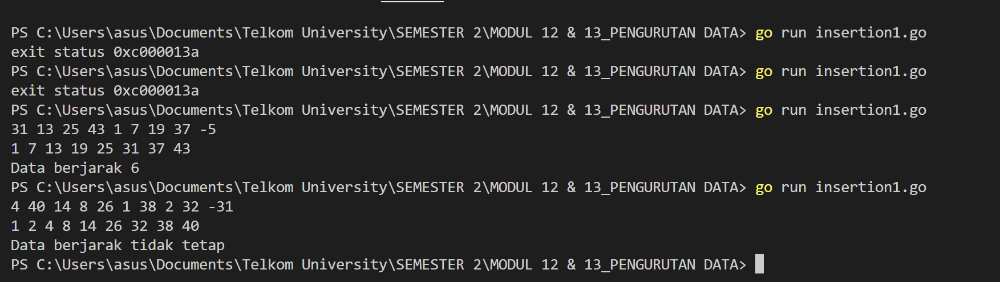
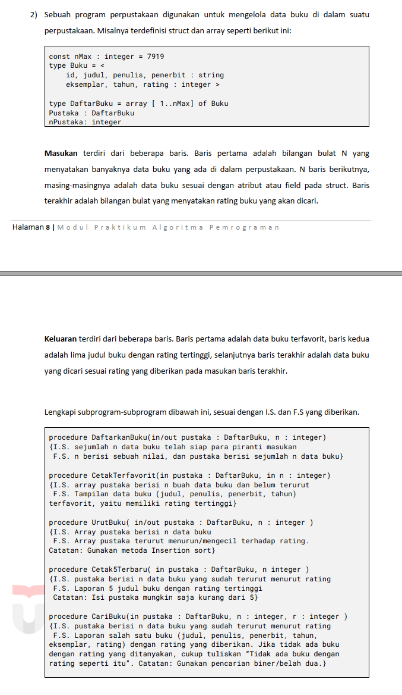
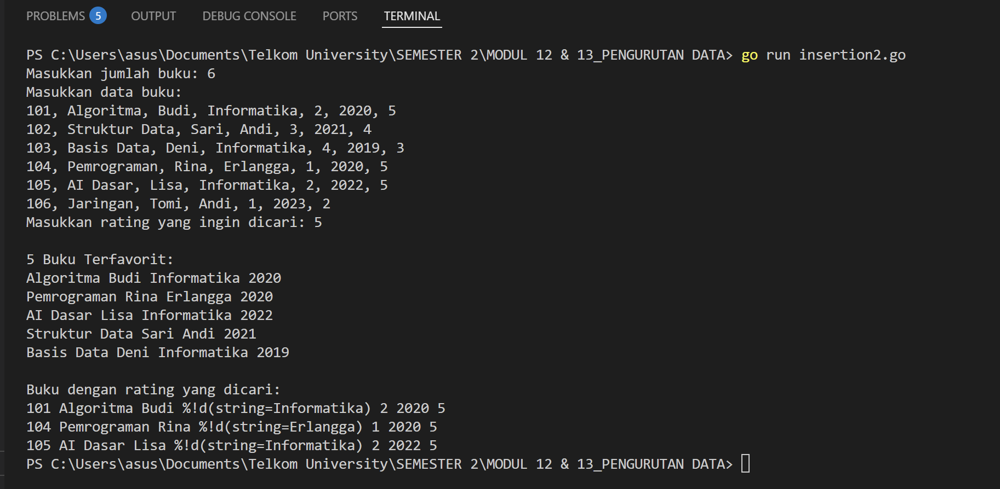

# <h1 align="center">Laporan Praktikum Modul 12 & 13 <br> Pengurutan Data</h1>

<p align="center">ANISA KEYZA HUSNUL KHATIMAH - 2211102210</p>

  

## Dasar Teori

Pengurutan secara selection short adalah mencari nilai ekstrim pada sekumpulan data,  
kemudian meletakkan pada posisi yang seharusnya. Pada penjelasan berikut ini data akan diurut  
membesar (ascending), dan data dengan indeks kecil ada di "kiri" dan indeks besar ada di  
"kanan".
Sementara pengurutan secara insertion ini idenya adalah menyisipkan suatu nilai pada posisi yang 
seharusnya. Berbeda dengan pengurutan seleksi, yang mana pada pengurutan ini tidak dilakukan  
pencarian nilai ekstrim terlebih dahulu, cukup memilih suatu nilai tertentu kemudian mencari  
posisinya secara sequential search. Pada penjelasan berikut ini data akan diurut mengecil  
(descending), dan data dengan indeks kecil ada di "kiri" dan indeks besar ada di "kanan".

## Unguided


## Soal Latihan Selection Short
### No. 1

Hercules, preman terkenal seantero ibukota, memiliki kerabat di banyak daerah. Tentunya  
Hercules sangat suka mengunjungi semua kerabatnya itu.  
Diberikan masukan nomor rumah dari semua kerabatnya di suatu daerah, buatlah program  
rumahkerabat yang akan menyusun nomor-nomor rumah kerabatnya secara terurut  
membesar menggunakan algoritma selection sort.  
Masukan dimulai dengan sebuah integer 𝒏 (0 < n < 1000), banyaknya daerah kerabat  
Hercules tinggal. Isi 𝒏 baris berikutnya selalu dimulai dengan sebuah integer 𝒎 (0 < m <  
1000000) yang menyatakan banyaknya rumah kerabat di daerah tersebut, diikuti dengan  
rangkaian bilangan bulat positif, nomor rumah para kerabat.  
Keluaran terdiri dari n baris, yaitu rangkaian rumah kerabatnya terurut membesar di masingmasing daerah.

```go
package main

import (
    "fmt"
)

func selectionSort(arr []int) {
    n := len(arr)
    for i := 0; i < n-1; i++ {
        minIdx := i
        for j := i + 1; j < n; j++ {
            if arr[j] < arr[minIdx] {
                minIdx = j
            }
        }
        arr[i], arr[minIdx] = arr[minIdx], arr[i]
    }
}

func main() {
    var n int
    fmt.Print("Masukkan jumlah daerah: ")
    fmt.Scan(&n)
  
    for i := 0; i < n; i++ {
        var m int
        fmt.Printf("Masukkan jumlah rumah di daerah %d: ", i+1)
        fmt.Scan(&m)
        
        arr := make([]int, m)
        fmt.Printf("Masukkan %d nomor rumah: ", m)
        for j := 0; j < m; j++ {
            fmt.Scan(&arr[j])
        }

        selectionSort(arr)

        // Cetak hasil
        for j := 0; j < m; j++ {
            fmt.Print(arr[j])
            if j != m-1 {
                fmt.Print(" ")
            }
        }
        fmt.Println()
    }
}
```

> Output
> 

Program ini bekerja dengan membaca input dari pengguna berupa jumlah daerah tempat tinggal kerabat Hercules. Untuk setiap daerah, program meminta jumlah rumah serta nomor-nomor rumah kerabat di daerah tersebut. Nomor-nomor rumah ini kemudian diurutkan menggunakan algoritma **Selection Sort**, yaitu algoritma sederhana yang mencari elemen terkecil dan menukarnya ke posisi yang tepat secara berulang. Setelah proses pengurutan selesai, program mencetak nomor rumah yang telah terurut dari setiap daerah dalam satu baris. Program ini berjalan secara interaktif melalui terminal dan memproses data satu daerah per satu waktu.


### No. 2

Belakangan diketahui ternyata Hercules itu tidak berani menyeberang jalan, maka selalu  
diusahakan agar hanya menyeberang jalan sesedikit mungkin, hanya diujung jalan. Karena  
nomor rumah sisi kiri jalan selalu ganjil dan sisi kanan jalan selalu genap, maka buatlah  
program kerabat dekat yang akan menampilkan nomor rumah mulai dari nomor yang ganjil  
lebih dulu terurut membesar dan kemudian menampilkan nomor rumah dengan nomor  
genap terurut mengecil.  
Format Masukan masih persis sama seperti sebelumnya.  
Keluaran terdiri dari n baris, yaitu rangkaian rumah kerabatnya terurut membesar untuk  
nomor ganjil, diikuti dengan terurut mengecil untuk nomor genap, di masing-masing daerah.

```go
package main

import (
    "fmt"
)

// Selection Sort untuk mengurutkan array menaik
func selectionSortAsc(arr []int) {
    n := len(arr)
    for i := 0; i < n-1; i++ {
        minIdx := i
        for j := i + 1; j < n; j++ {
            if arr[j] < arr[minIdx] {
                minIdx = j
            }
        }
        arr[i], arr[minIdx] = arr[minIdx], arr[i]
    }
}

// Selection Sort untuk mengurutkan array menurun
func selectionSortDesc(arr []int) {
    n := len(arr)
    for i := 0; i < n-1; i++ {
        maxIdx := i
        for j := i + 1; j < n; j++ {
            if arr[j] > arr[maxIdx] {
                maxIdx = j
            }
        }
        arr[i], arr[maxIdx] = arr[maxIdx], arr[i]
    }
}

func main() {
    var n int
    fmt.Print("Masukkan jumlah daerah: ")
    fmt.Scan(&n)

    for i := 0; i < n; i++ {
        var m int
        fmt.Printf("Masukkan jumlah rumah di daerah %d: ", i+1)
        fmt.Scan(&m)

		ganjil := []int{}
        genap := []int{}

        fmt.Printf("Masukkan %d nomor rumah: ", m)
        for j := 0; j < m; j++ {
            var num int
            fmt.Scan(&num)
            if num%2 == 1 {
                ganjil = append(ganjil, num)
            } else {
                genap = append(genap, num)
            }
        }

        selectionSortAsc(ganjil)
        selectionSortDesc(genap)
        
        for _, g := range ganjil {
            fmt.Print(g, " ")
        }
        for _, e := range genap {
            fmt.Print(e, " ")
        }
        fmt.Println()
    }
}
```

> Output
> 

Program ini bertujuan untuk menampilkan nomor rumah kerabat Hercules di setiap daerah dengan aturan: **angka ganjil diurutkan naik**, kemudian diikuti **angka genap diurutkan turun**. Program dimulai dengan membaca jumlah daerah, lalu untuk setiap daerah, dibaca jumlah rumah dan nomor-nomornya.

Nomor rumah tersebut dipisahkan menjadi dua kelompok: bilangan **ganjil** dan **genap**. Masing-masing kelompok kemudian diurutkan menggunakan algoritma **Selection Sort**—ganjil secara menaik, genap secara menurun. Setelah itu, hasil pengurutan digabung dan ditampilkan dalam satu baris untuk tiap daerah.

### No. 3

Kompetisi pemrograman yang baru saja berlalu diikuti oleh 17 tim dari berbagai perguruan  
tinggi ternama. Dalam kompetisi tersebut, setiap tim berlomba untuk menyelesaikan  
sebanyak mungkin problem yang diberikan. Dari 13 problem yang diberikan, ada satu  
problem yang menarik. Problem tersebut mudah dipahami, hampir semua tim mencoba  
untuk menyelesaikannya, tetapi hanya 3 tim yang berhasil. Apa sih problemnya?  
"Median adalah nilai tengah dari suatu koleksi data yang sudah terurut. Jika jumlah data  
genap, maka nilai median adalah rerata dari kedua nilai tengahnya. Pada problem ini, semua  
data merupakan bilangan bulat positif, dan karenanya rerata nilai tengah dibulatkan ke  
bawah."  
Buatlah program median yang mencetak nilai median terhadap seluruh data yang sudah  
terbaca, jika data yang dibaca saat itu adalah 0.  
Masukan berbentuk rangkaian bilangan bulat. Masukan tidak akan berisi lebih dari 1000000  
data, tidak termasuk bilangan 0. Data 0 merupakan tanda bahwa median harus dicetak, tidak  
termasuk data yang dicari mediannya. Data masukan diakhiri dengan bilangan bulat -5313.  
Keluaran adalah median yang diminta, satu data per baris


```go
package main

import (
    "fmt"
)

// Fungsi Selection Sort untuk pengurutan menaik
func selectionSort(arr []int) {
    n := len(arr)
    for i := 0; i < n-1; i++ {
        minIdx := i
        for j := i + 1; j < n; j++ {
            if arr[j] < arr[minIdx] {
                minIdx = j
            }
        }
        arr[i], arr[minIdx] = arr[minIdx], arr[i]
    }
}

// Fungsi untuk menghitung median dari array yang sudah di-sort
func getMedian(arr []int) int {
    n := len(arr)
    if n%2 == 1 {
        return arr[n/2]
    }
    return (arr[n/2-1] + arr[n/2]) / 2
}

func main() {
    var input int
    var data []int

    for {
        fmt.Scan(&input)

        if input == -5313 {
            break
        } else if input == 0 {
            // Buat salinan array untuk disortir agar array asli tidak berubah
            temp := make([]int, len(data))
            copy(temp, data)
            selectionSort(temp)
            fmt.Println(getMedian(temp))
        } else {
            data = append(data, input)
        }
    }
}
```

> Output
> 

Program ini membaca data berupa bilangan bulat positif hingga menemukan nilai `-5313` sebagai tanda akhir input. Setiap kali nilai `0` ditemukan, program menghitung median dari seluruh data sebelumnya dengan cara mengurutkannya menggunakan algoritma **Selection Sort**, lalu mencari nilai tengah (median). Jika jumlah data genap, median dihitung sebagai rata-rata dua nilai tengah, dibulatkan ke bawah.

## Soal Latihan Insertion Sort
### No. 1


```go
package main

import (
    "bufio"
    "fmt"
    "os"
    "strconv"
    "strings"
)

// Fungsi insertion sort
func insertionSort(arr []int) {
    for i := 1; i < len(arr); i++ {
        key := arr[i]
        j := i - 1
        for j >= 0 && arr[j] > key {
            arr[j+1] = arr[j]
            j--
        }
        arr[j+1] = key
    }
}

// Fungsi untuk cek apakah jarak antar elemen tetap
func cekJarakTetap(arr []int) (int, bool) {
    if len(arr) < 2 {
        return 0, true
    }
    jarak := arr[1] - arr[0]
    for i := 1; i < len(arr)-1; i++ {
        if arr[i+1]-arr[i] != jarak {
            return 0, false
        }
    }
    return jarak, true
}

func main() {
    scanner := bufio.NewScanner(os.Stdin)
    fmt.Println("Masukkan angka (pisahkan dengan spasi, akhiri dengan angka negatif):")
    scanner.Scan()
    line := scanner.Text()

    // Split input dan simpan bilangan non-negatif ke array
    tokens := strings.Fields(line)
    var data []int
    
    for _, token := range tokens {
        num, err := strconv.Atoi(token)
        if err != nil {
            fmt.Println("Input tidak valid:", token)
            return
        }
        if num < 0 {
            break
        }
        data = append(data, num)
    }

    if len(data) == 0 {
        fmt.Println("Tidak ada data yang diproses.")
        return
    }

    // Urutkan data
    insertionSort(data)

    // Cetak array terurut
    for _, val := range data {
        fmt.Print(val, " ")
    }
    fmt.Println()

    // Cek jarak
    if jarak, tetap := cekJarakTetap(data); tetap {
        fmt.Printf("Data berjarak %d\n", jarak)
    } else {
        fmt.Println("Data berjarak tidak tetap")
    }
}
```

> Output
> 

Program ini dimulai dengan meminta pengguna memasukkan serangkaian bilangan bulat yang dipisahkan oleh spasi. Bilangan-bilangan tersebut akan dibaca satu per satu hingga ditemukan sebuah bilangan negatif, yang menjadi tanda akhir input. Hanya bilangan non-negatif yang disimpan ke dalam sebuah array.

Setelah semua data dibaca dan disimpan, program kemudian mengurutkan array tersebut menggunakan metode _insertion sort_, yaitu metode pengurutan sederhana yang menyisipkan elemen satu per satu ke posisi yang sesuai agar urut.

Setelah data terurut, program akan mencetak isi array hasil pengurutan ke layar. Selanjutnya, program memeriksa apakah jarak antar elemen yang berurutan di dalam array tersebut adalah tetap atau tidak. Jika semua jaraknya sama, maka program menampilkan “Data berjarak x”, di mana x adalah nilai jaraknya. Jika tidak, maka akan ditampilkan “Data berjarak tidak tetap”.

Dengan demikian, program ini tidak hanya mengurutkan data, tetapi juga menganalisis pola jarak antar elemen setelah pengurutan.

### No. 2

> 

```go
package main

import (
    "bufio"
    "fmt"
    "os"
    "strconv"
    "strings"
)

// Struktur Buku
type Buku struct {
    id                       string
    judul                    string
    penulis                  string
    penerbit                 string
    eksemplar, tahun, rating int
}

// Insertion sort berdasarkan rating (menurun)
func insertionSort(pustaka []Buku) {
    for i := 1; i < len(pustaka); i++ {
        key := pustaka[i]
        j := i - 1
        for j >= 0 && pustaka[j].rating < key.rating {
            pustaka[j+1] = pustaka[j]
            j--
        }
        pustaka[j+1] = key
    }
}

// Cetak 5 buku dengan rating tertinggi
func cetak5Terbaru(pustaka []Buku) {
    n := 5
    if len(pustaka) < 5 {
        n = len(pustaka)
    }
    for i := 0; i < n; i++ {
        fmt.Printf("%s %s %s %d\n", pustaka[i].judul, pustaka[i].penulis, pustaka[i].penerbit, pustaka[i].tahun)
    }
}

// Cari buku dengan rating tertentu menggunakan binary search
func cariBuku(pustaka []Buku, rating int) {
    low := 0
    high := len(pustaka) - 1
    found := false

    for low <= high {
        mid := (low + high) / 2
        if pustaka[mid].rating == rating {
            found = true
            // Mencetak semua buku dengan rating tersebut
            i := mid
            for i >= 0 && pustaka[i].rating == rating {
                i--
            }
            i++
            for i < len(pustaka) && pustaka[i].rating == rating {
                b := pustaka[i]
                fmt.Printf("%s %s %s %d %d %d %d\n", b.id, b.judul, b.penulis, b.penerbit, b.eksemplar, b.tahun, b.rating)
                i++
            }
            break
        } else if pustaka[mid].rating < rating {
            high = mid - 1
        } else {
            low = mid + 1
        }
    }

    if !found {
        fmt.Println("Tidak ada buku dengan rating seperti itu.")
    }
}

func main() {
    scanner := bufio.NewScanner(os.Stdin)

    // Input jumlah buku
    fmt.Print("Masukkan jumlah buku: ")
    scanner.Scan()
    n, _ := strconv.Atoi(scanner.Text())
    var pustaka []Buku

    // Input data buku
    fmt.Println("Masukkan data buku:")
    for i := 0; i < n; i++ {
        scanner.Scan()
        fields := strings.Split(scanner.Text(), ",")

        eksemplar, _ := strconv.Atoi(strings.TrimSpace(fields[4]))
        tahun, _ := strconv.Atoi(strings.TrimSpace(fields[5]))
        rating, _ := strconv.Atoi(strings.TrimSpace(fields[6]))

        b := Buku{
            id:        strings.TrimSpace(fields[0]),
            judul:     strings.TrimSpace(fields[1]),
            penulis:   strings.TrimSpace(fields[2]),
            penerbit:  strings.TrimSpace(fields[3]),
            eksemplar: eksemplar,
            tahun:     tahun,
            rating:    rating,
        }
        pustaka = append(pustaka, b)
    }

    // Input rating yang dicari
    fmt.Print("Masukkan rating yang ingin dicari: ")
    scanner.Scan()
    ratingDicari, _ := strconv.Atoi(scanner.Text())

    // Urutkan
    insertionSort(pustaka)

    // Cetak 5 buku rating tertinggi
    fmt.Println("\n5 Buku Terfavorit:")
    cetak5Terbaru(pustaka)

    // Cari buku berdasarkan rating
    fmt.Println("\nBuku dengan rating yang dicari:")
    cariBuku(pustaka, ratingDicari)
}
```

> Output
> 

Program ini bekerja layaknya sistem pencatatan buku perpustakaan yang mampu mengelola dan menampilkan informasi berdasarkan tingkat rating buku. Ketika program dijalankan, pertama-tama pengguna diminta untuk memasukkan jumlah buku yang ingin dicatat. Setelah itu, pengguna akan mengisi data setiap buku berupa ID, judul, nama penulis, nama penerbit, jumlah eksemplar, tahun terbit, dan rating buku tersebut. Semua informasi ini disimpan dalam bentuk struktur data yang disebut `Buku`.

Setelah seluruh data buku dimasukkan, pengguna diminta untuk mengetikkan sebuah nilai rating yang ingin dicari. Program kemudian akan mengurutkan seluruh data buku berdasarkan nilai rating secara menurun, menggunakan metode **insertion sort**—yaitu proses menyisipkan data ke posisi yang tepat secara bertahap.

Setelah buku-buku berhasil diurutkan, program akan menampilkan **lima buku teratas dengan rating tertinggi**. Informasi yang ditampilkan meliputi judul, penulis, penerbit, dan tahun terbit.

Sebagai bagian terakhir, program akan mencari dan menampilkan semua buku yang memiliki **rating sama seperti yang dicari pengguna**. Jika ditemukan, seluruh informasi buku tersebut akan dicetak ke layar. Namun, jika tidak ada buku yang sesuai, maka program akan menampilkan pesan: **"Tidak ada buku dengan rating seperti itu."**

Secara keseluruhan, program ini memadukan proses pengumpulan data, pengurutan, dan pencarian untuk membantu pengguna menemukan buku-buku terbaik dalam koleksi perpustakaan berdasarkan rating.