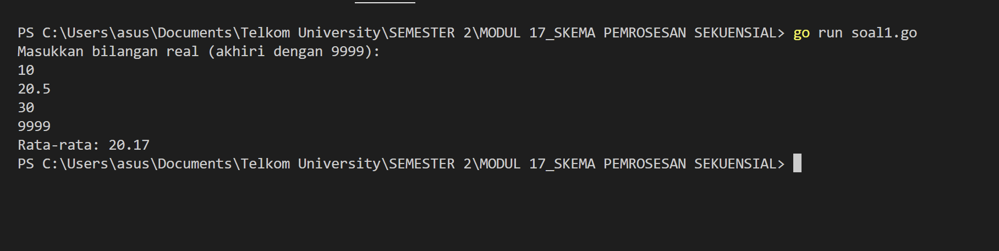
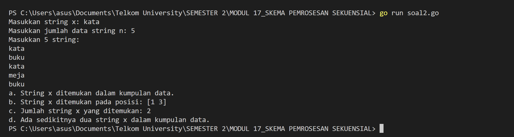
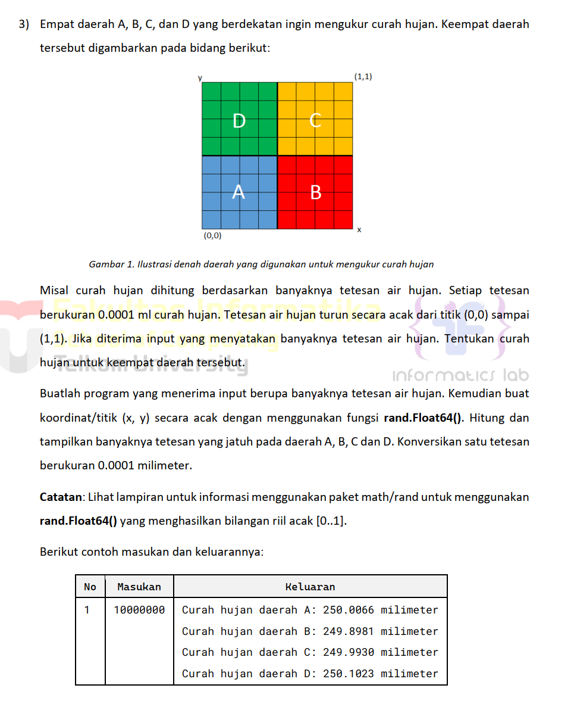
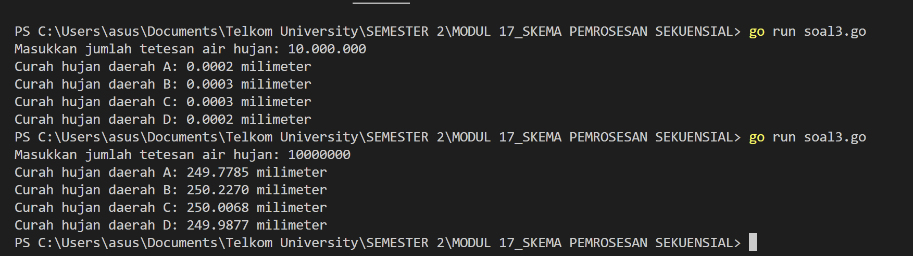
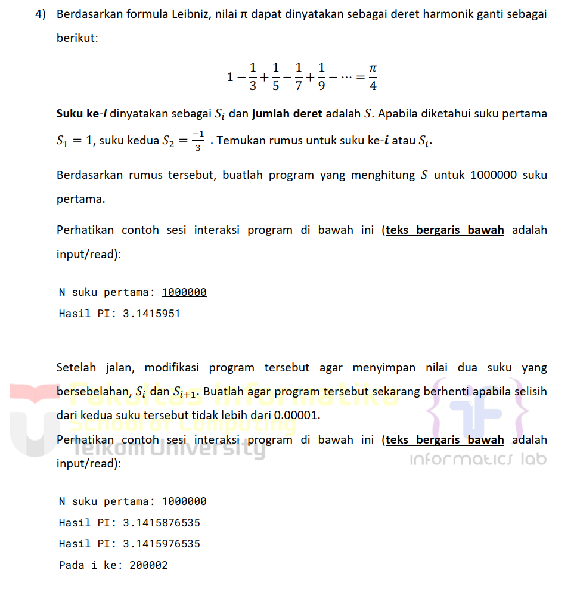
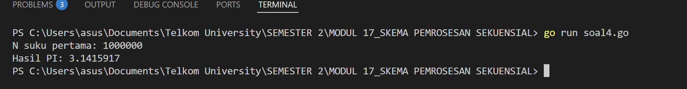
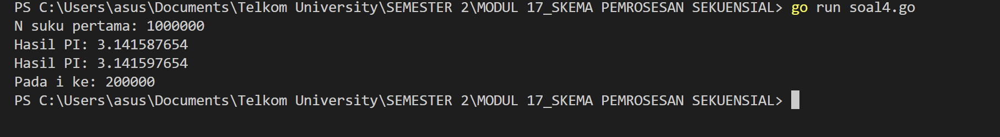
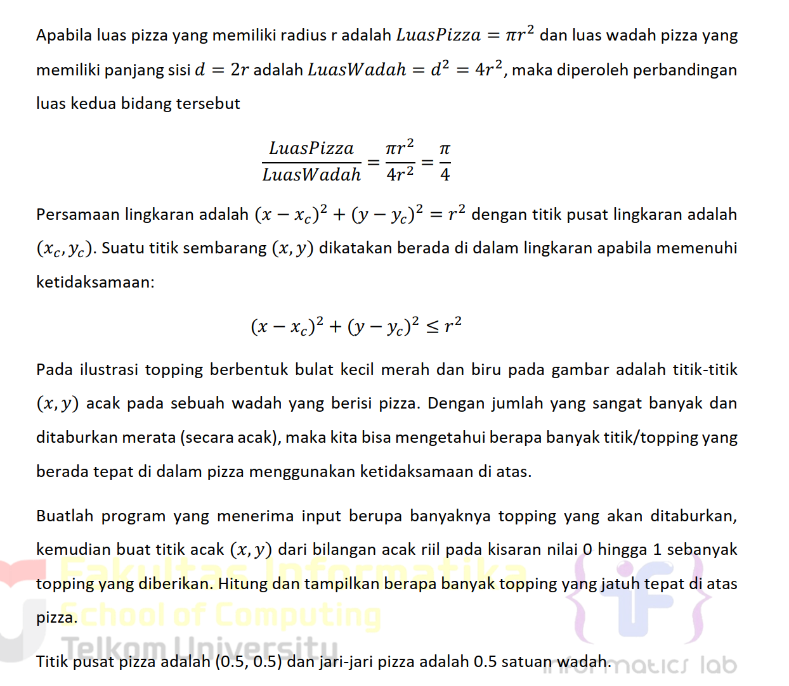
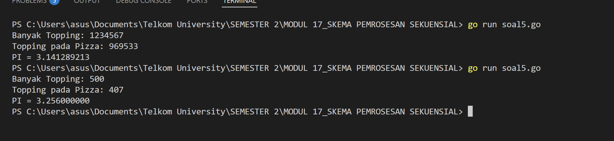

# <h1 align="center">Laporan Praktikum Modul 17 <br> Skema Pemrosesan Sekuensial</h1>

<p align="center">ANISA KEYZA HUSNUL KHATIMAH - 2211102210</p>

  

## Dasar Teori

**Skema Pemrosesan Sekuensial** adalah salah satu bentuk dasar alur kontrol dalam algoritma, di mana **instruksi dieksekusi satu per satu secara berurutan dari atas ke bawah**, tanpa adanya percabangan (kondisi) atau perulangan (loop).

## Unguided


### No. 1

Diberikan sejumlah bilangan real yang diakhiri dengan marker 9999, cari rerata dari bilanganbilangan tersebut.

```go
package main

import (
    "fmt"
)

func main() {
    var input float64
    var total float64 = 0
    var count int = 0

    fmt.Println("Masukkan bilangan real (akhiri dengan 9999):")
    for {
        fmt.Scan(&input)
        if input == 9999 {
            break
        }
        total += input
        count++
    }

    if count > 0 {
        average := total / float64(count)
        fmt.Printf("Rata-rata: %.2f\n", average)
    } else {
        fmt.Println("Tidak ada data untuk dihitung rata-ratanya.")
    }
}
```

> Output
> 

Program ini meminta pengguna memasukkan beberapa bilangan real satu per satu. Setiap angka yang dimasukkan akan dijumlahkan dan dihitung jumlah datanya. Proses ini terus berlangsung hingga pengguna mengetik angka **9999** sebagai tanda berhenti. Setelah itu, program menghitung dan menampilkan **rata-rata** dari semua bilangan yang telah dimasukkan. Jika tidak ada data (selain 9999), program akan menampilkan pesan bahwa tidak ada data untuk dihitung.


### No. 2

Diberikan string x dan n buah string. x adalah data pertama yang dibaca, n adalah data  
bilangan yang dibaca kedua, dan n data berikutnya adalah data string. Buat algoritma untuk  
menjawab pertanyaan berikut:  
a. Apakah string x ada dalam kumpulan n data string tersebut?  
b. Pada posisi ke berapa string x tersebut ditemukan?
c. Ada berapakah string x dalam kumpulan n data string tersebut?  
d. Adakah sedikitnya dua string x dalam n data string tersebut?

```go
package main

import (
    "fmt"
)

func main() {
    var x string
    var n int

    // Input string x dan jumlah n
    fmt.Print("Masukkan string x: ")
    fmt.Scan(&x)
    fmt.Print("Masukkan jumlah data string n: ")
    fmt.Scan(&n)

    // Input kumpulan string
    strings := make([]string, n)
    fmt.Println("Masukkan", n, "string:")
    for i := 0; i < n; i++ {
        fmt.Scan(&strings[i])
    }

    // Inisialisasi variabel
    found := false
    positions := []int{}
    count := 0

    // Proses pencarian
    for i := 0; i < n; i++ {
        if strings[i] == x {
            found = true
            count++
            positions = append(positions, i+1) // posisi dimulai dari 1
        }
    }

    // Jawaban a
    if found {
        fmt.Println("a. String x ditemukan dalam kumpulan data.")
    } else {
        fmt.Println("a. String x TIDAK ditemukan dalam kumpulan data.")
    }

    // Jawaban b
    if len(positions) > 0 {
        fmt.Println("b. String x ditemukan pada posisi:", positions)
    } else {
        fmt.Println("b. String x tidak ditemukan, jadi tidak ada posisi.")
    }
    
    // Jawaban c
    fmt.Printf("c. Jumlah string x yang ditemukan: %d\n", count)
  
    // Jawaban d
    if count >= 2 {
        fmt.Println("d. Ada sedikitnya dua string x dalam kumpulan data.")
    } else {
        fmt.Println("d. TIDAK ada sedikitnya dua string x dalam kumpulan data.")
    }
}
```

> Output
> 

Program ini dibuat untuk mencari sebuah string tertentu (`x`) di dalam sekumpulan string sebanyak `n` buah. Pertama, program meminta pengguna memasukkan string `x` dan jumlah data `n`. Setelah itu, pengguna memasukkan `n` string satu per satu.

Program kemudian memeriksa:
- Apakah string `x` muncul dalam data.
- Di posisi ke berapa saja string `x` ditemukan.
- Berapa kali string `x` muncul.
- Apakah string `x` muncul minimal dua kali.

Hasil dari pemeriksaan tersebut ditampilkan dalam bentuk jawaban poin a sampai d sesuai soal.

### No. 3

> 

```go
package main

import (
    "fmt"
    "math/rand"
    "time"
)

func main() {
    var totalDrops int
    const rainPerDrop = 0.0001 // mm per tetesan

    // Input jumlah tetesan
    fmt.Print("Masukkan jumlah tetesan air hujan: ")
    fmt.Scan(&totalDrops)

    // Inisialisasi counter untuk setiap daerah
    var aDrops, bDrops, cDrops, dDrops int

    // Inisialisasi seed random
    rand.Seed(time.Now().UnixNano())

    // Loop untuk setiap tetesan
    for i := 0; i < totalDrops; i++ {
        x := rand.Float64() // nilai antara 0.0 - 1.0
        y := rand.Float64()

        // Tentukan daerah berdasarkan koordinat
        if x < 0.5 && y < 0.5 {
            aDrops++
        } else if x >= 0.5 && y < 0.5 {
            bDrops++
        } else if x >= 0.5 && y >= 0.5 {
            cDrops++
        } else if x < 0.5 && y >= 0.5 {
            dDrops++
        }
    }

    // Hitung curah hujan
    curahA := float64(aDrops) * rainPerDrop
    curahB := float64(bDrops) * rainPerDrop
    curahC := float64(cDrops) * rainPerDrop
    curahD := float64(dDrops) * rainPerDrop

    // Tampilkan hasil
    fmt.Printf("Curah hujan daerah A: %.4f milimeter\n", curahA)
    fmt.Printf("Curah hujan daerah B: %.4f milimeter\n", curahB)
    fmt.Printf("Curah hujan daerah C: %.4f milimeter\n", curahC)
    fmt.Printf("Curah hujan daerah D: %.4f milimeter\n", curahD)
}
```

> Output
> 

Program ini menerima input berupa jumlah tetesan hujan. Lalu, untuk setiap tetesan, program menghasilkan koordinat acak `(x, y)` dari [0,1] menggunakan `rand.Float64()`. Berdasarkan posisi tetesan di bidang (0,0)-(1,1), program menentukan apakah tetesan jatuh ke daerah A, B, C, atau D. Jumlah tetesan tiap daerah kemudian dikalikan 0.0001 mm untuk mendapatkan curah hujan. Akhirnya, program mencetak curah hujan masing-masing daerah.

### No. 4



### Versi 1

```go
package main

import (
    "fmt"
)

func main() {
    var n int
    fmt.Print("N suku pertama: ")
    fmt.Scan(&n)

    sum := 0.0

    for i := 0; i < n; i++ {
        term := 1.0 / float64(2*i+1)
        if i%2 == 1 {
            term = -term
        }
        sum += term
    }

    pi := sum * 4
    fmt.Printf("Hasil PI: %.7f\n", pi)
}
```

> Output
> 

### Versi 2

```go
package main

import (
	"fmt"
	"math"
)

func main() {
	var maxTerms int
	fmt.Print("N suku pertama: ")
	fmt.Scan(&maxTerms)

	sum := 0.0
	prevPi := 0.0
	var pi float64
	var i int

	for i = 0; i < maxTerms; i++ {
		term := 1.0 / float64(2*i+1)
		if i%2 == 1 {
			term = -term
		}
		sum += term
		pi = sum * 4

		// Hentikan jika selisih hasil PI sebelumnya dengan saat ini < 0.00001
		if i > 0 && math.Abs(pi-prevPi) < 0.00001 {
			break
		}
		prevPi = pi
	}

	fmt.Printf("Hasil PI: %.9f\n", prevPi)
	fmt.Printf("Hasil PI: %.9f\n", pi)
	fmt.Printf("Pada i ke: %d\n", i)
}

```

> Output
> 

Program ini menggunakan deret Leibniz untuk menghitung π. Pada versi pertama, ia menjumlahkan N suku pertama dan mengalikan hasilnya dengan 4. Pada versi kedua, program menghentikan proses jika dua hasil berturut-turut dari π memiliki selisih kurang dari 0.00001, dan melaporkan pada iterasi keberapa hal ini terjadi.

### No. 5

Monti bekerja pada sebuah kedai pizza, saking ramainya kedai tersebut membuat Monti tidak  
ada waktu untuk bersantai. Suatu ketika saat sedang menaburkan topping pada pizza yang  
diletakkan pada wadah berbentuk persegi, terpikirkan oleh Monti cara menghitung berapa  
banyak topping yang dia butuhkan, dan cara menghitung nilai 𝝅.  
Ilustrasi seperti gambar yang diberikan di bawah, topping adalah lingkaran-lingkaran kecil.  
Ada yang tepat berada di atas pizza, dan ada yang jatuh di dalam kotak tetapi berada di luar  
pizza.

> 

```go
package main

import (
    "fmt"
    "math"
    "math/rand"
    "time"
)

func main() {
    var toppingTotal int
    fmt.Print("Banyak Topping: ")
    fmt.Scan(&toppingTotal)

    rand.Seed(time.Now().UnixNano())

    toppingDalamPizza := 0

    for i := 0; i < toppingTotal; i++ {
        x := rand.Float64() // [0.0, 1.0]
        y := rand.Float64()
        
        // Cek apakah titik (x, y) berada di dalam lingkaran pizza
        if math.Pow(x-0.5, 2)+math.Pow(y-0.5, 2) <= 0.25 {
            toppingDalamPizza++
        }
    }

    // Estimasi PI
    pi := 4 * float64(toppingDalamPizza) / float64(toppingTotal)
    fmt.Printf("Topping pada Pizza: %d\n", toppingDalamPizza)
    fmt.Printf("PI = %.9f\n", pi)
}
```

> Output
> 

Program ini menggunakan pendekatan **Monte Carlo** untuk memperkirakan nilai π. Topping-topping pizza ditaburkan secara acak ke dalam wadah pizza berukuran 1x1 satuan. Titik-titik yang jatuh di dalam lingkaran pusat `(0.5,0.5)` dan jari-jari 0.5 dihitung sebagai "berada di dalam pizza". Proporsi antara topping dalam pizza dan total topping digunakan untuk menghitung nilai π.