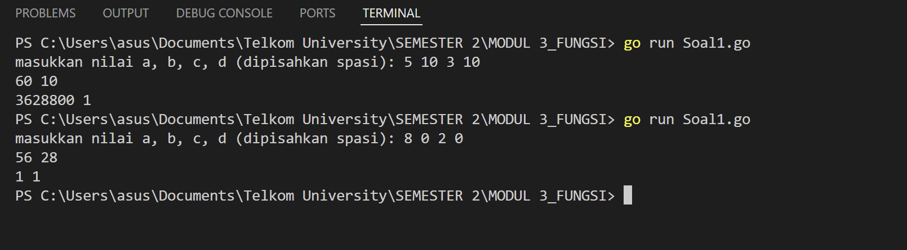
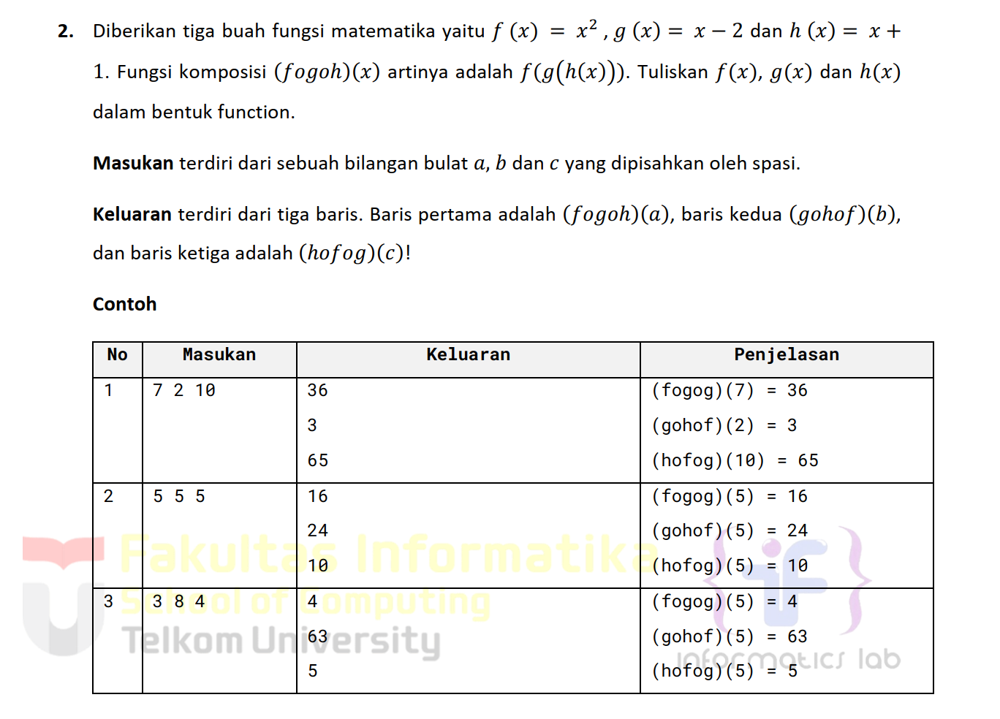
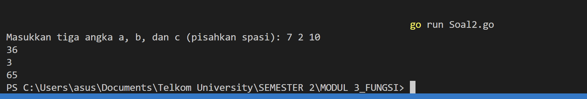
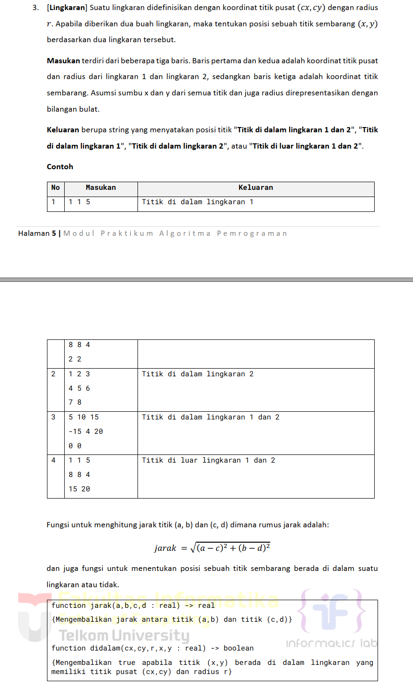
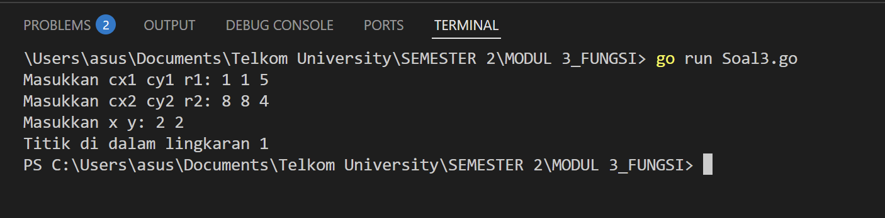

# <h1 align="center">Laporan Praktikum Modul 3 <br> Review Pengenalan Pemrograman</h1>

<p align="center">ANISA KEYZA HUSNUL KHATIMAH - 2211102210</p>

  

## Dasar Teori

Fungsi merupakan satu kesatuan rangkaian instruksi yang memberikan atau menghasilkan suatu  
nilai dan biasanya memetakkan input ke suatu nilai yang lain. Oleh karena itu, fungsi selalu  
menghasilkan/mengembalikan nilai.

## Unguided


### Soal 1

 Minggu ini, mahasiswa Fakultas Informatika mendapatkan tugas dari mata kuliah matematika diskrit untuk mempelajari kombinasi dan permutasi. Jonas salah seorang mahasiswa, iseng untuk mengimplementasikannya ke dalam suatu program. Oleh karena itu bersediakah kalian membantu Jonas? (tidak tentunya ya :p) Masukan terdiri dari empat buah bilangan asli 𝑎, 𝑏, 𝑐, dan 𝑑 yang dipisahkan oleh spasi, dengan syarat 𝑎≥ 𝑐 dan 𝑏≥ 𝑑. Keluaran terdiri dari dua baris. Baris pertama adalah hasil permutasi dan kombinasi 𝒂 terhadap 𝑐, sedangkan baris kedua adalah hasil permutasi dan kombinasi 𝑏 terhadap 𝑑. Catatan: permutasi (P) dan kombinasi (C) dari 𝑛 terhadap 𝑟 (𝑛≥𝑟) dapat dihitung dengan menggunakan persamaan berikut!

> 

```go
package main

import (
    "fmt"
)

// fungsi hitung faktorial
func factorial(n int) int {
    if n == 0 || n == 1 {
        return 1
    }
    result := 1
    for i := 2; i <= n; i++ {
        result *= i
    }
    return result
}

// fungsi hitung permutasi
func permutation(n, r int) int {
    return factorial(n) / factorial(n-r)
}

// fungsi hitung kombinasi
func combination(n, r int) int {
    return factorial(n) / (factorial(r) * factorial(n-r))
}
func main() {
    var a, b, c, d int
    fmt.Print("masukkan nilai a, b, c, d (dipisahkan spasi): ")
    fmt.Scan(&a, &b, &c, &d)

//hasil
    fmt.Println(permutation(a, c), combination(a, c))
    fmt.Println(permutation(b, d), combination(b, d))
}
```

> Output
> 

Program ini dirancang untuk menghitung nilai permutasi dan kombinasi dari dua pasangan angka yang dimasukkan oleh pengguna. Pengguna akan diminta memasukkan empat buah bilangan, yaitu `a`, `b`, `c`, dan `d`, dengan ketentuan bahwa nilai `a` harus lebih besar atau sama dengan `c`, serta `b` lebih besar atau sama dengan `d`. Setelah menerima input, program akan melakukan perhitungan menggunakan rumus matematika dasar.

Permutasi digunakan untuk menentukan banyaknya cara menyusun `r` elemen dari total `n` elemen secara berurutan, sedangkan kombinasi digunakan untuk mengetahui berapa banyak cara memilih `r` elemen dari `n` elemen tanpa memperhatikan urutannya.

Hasil perhitungan ditampilkan dalam dua baris: baris pertama menunjukkan hasil dari pasangan nilai `a` dan `c`, dan baris kedua menampilkan hasil dari pasangan `b` dan `d`.
  

### Soal 2

Diberikan tiga buah fungsi matematika yaitu 𝑓 (𝑥) = 𝑥2 , 𝑔 (𝑥) = 𝑥 - 2 dan ℎ (𝑥) = 𝑥 +  
1. Fungsi komposisi (𝑓𝑜𝑔𝑜ℎ)(𝑥) artinya adalah 𝑓(𝑔(ℎ(𝑥))). Tuliskan 𝑓(𝑥), 𝑔(𝑥) dan ℎ(𝑥)  
dalam bentuk function.  
Masukan terdiri dari sebuah bilangan bulat 𝑎, 𝑏 dan 𝑐 yang dipisahkan oleh spasi.  
Keluaran terdiri dari tiga baris. Baris pertama adalah (𝑓𝑜𝑔𝑜ℎ)(𝑎), baris kedua (𝑔𝑜ℎ𝑜𝑓)(𝑏),  
dan baris ketiga adalah (ℎ𝑜𝑓𝑜𝑔)(𝑐)!

> 
```go
package main

import (
    "fmt"
)

func f(x int) int {
    return x * x
}

func g(x int) int {
    return x - 2
}

func h(x int) int {
    return x + 1
}

// Perbaikan komposisi berdasarkan hasil di tabel
func fogoh(x int) int {
    return f(g(h(x))) // BUKAN f(g(h(g(x))))
}

func gohof(x int) int {
    return g(h(f(x)))
}

func hofog(x int) int {
    return h(f(g(x)))
}

func main() {
    var a, b, c int
    fmt.Print("Masukkan tiga angka a, b, dan c (pisahkan spasi): ")
    fmt.Scan(&a, &b, &c)
    fmt.Println(fogoh(a)) // Baris 1
    fmt.Println(gohof(b)) // Baris 2
    fmt.Println(hofog(c)) // Baris 3
}
```


> Output
>  

Program ini dirancang untuk melakukan komposisi fungsi matematika secara berurutan terhadap tiga buah bilangan bulat yang dimasukkan oleh pengguna. Terdapat tiga buah fungsi dasar: `f(x) = x * x`, `g(x) = x - 2`, dan `h(x) = x + 1`, yang masing-masing merepresentasikan operasi sederhana berupa kuadrat, pengurangan dua, dan penambahan satu.

Saat program dijalankan, pengguna diminta untuk memasukkan tiga bilangan bulat, yaitu `a`, `b`, dan `c`. Ketiga nilai tersebut kemudian digunakan sebagai argumen dalam tiga bentuk komposisi fungsi yang berbeda:

1. **fogoh(a)** — menggabungkan fungsi `f`, `g`, dan `h` dalam urutan `f(g(h(x)))`, yang berarti nilai `a` pertama-tama ditambah satu (`h`), kemudian dikurangi dua (`g`), lalu dikuadratkan (`f`).
2. **gohof(b)** — menerapkan `g(h(f(x)))`, yaitu nilai `b` dikuadratkan terlebih dahulu (`f`), lalu ditambah satu (`h`), dan terakhir dikurangi dua (`g`).
3. **hofog(c)** — menerapkan `h(f(g(x)))`, yakni nilai `c` dikurangi dua (`g`), kemudian dikuadratkan (`f`), dan hasil akhirnya ditambah satu (`h`).

Setelah dilakukan komposisi fungsi sesuai urutan tersebut, hasil dari masing-masing operasi ditampilkan dalam tiga baris berturut-turut. Dengan pendekatan ini, program memberikan ilustrasi konkret tentang bagaimana fungsi-fungsi matematika dapat disusun dan dikombinasikan untuk menghasilkan berbagai transformasi terhadap suatu nilai input.  


### Soal 3

> 


```go
package main

import (
    "fmt"
    "math"
)

// Fungsi untuk menghitung jarak antara dua titik (a,b) dan (c,d)
func jarak(a, b, c, d float64) float64 {
    return math.Sqrt(math.Pow(a-c, 2) + math.Pow(b-d, 2))
}

// Fungsi untuk mengecek apakah titik (x, y) berada di dalam lingkaran dengan pusat (cx, cy) dan radius r
func didalam(cx, cy, r, x, y float64) bool {
    return jarak(cx, cy, x, y) <= r
}

func main() {
    var cx1, cy1, r1 float64
    var cx2, cy2, r2 float64
    var x, y float64

    // Input lingkaran 1
    fmt.Print("Masukkan cx1 cy1 r1: ")
    fmt.Scan(&cx1, &cy1, &r1)

    // Input lingkaran 2
    fmt.Print("Masukkan cx2 cy2 r2: ")
    fmt.Scan(&cx2, &cy2, &r2)

    // Input titik x, y
    fmt.Print("Masukkan x y: ")
    fmt.Scan(&x, &y)

    // Cek posisi titik terhadap kedua lingkaran
    in1 := didalam(cx1, cy1, r1, x, y)
    in2 := didalam(cx2, cy2, r2, x, y)

    // Output berdasarkan hasil pengecekan
    if in1 && in2 {
        fmt.Println("Titik di dalam lingkaran 1 dan 2")
    } else if in1 {
        fmt.Println("Titik di dalam lingkaran 1")
    } else if in2 {
        fmt.Println("Titik di dalam lingkaran 2")
    } else {
        fmt.Println("Titik di luar lingkaran 1 dan 2")
    }
}
```


>Output
> 

Program ini dibuat untuk menentukan posisi sebuah titik terhadap dua buah lingkaran. Setiap lingkaran didefinisikan oleh titik pusat dan jari-jarinya, lalu pengguna diminta memasukkan tiga baris input: data lingkaran pertama, lingkaran kedua, dan koordinat titik yang ingin diperiksa.

Dengan menggunakan rumus jarak Euclidean, program menghitung jarak titik terhadap masing-masing pusat lingkaran. Jika jarak tersebut kurang dari atau sama dengan jari-jari, maka titik dianggap berada di dalam lingkaran tersebut. Hasil akhirnya adalah sebuah pernyataan yang menunjukkan apakah titik berada di dalam salah satu, kedua, atau di luar kedua lingkaran.
