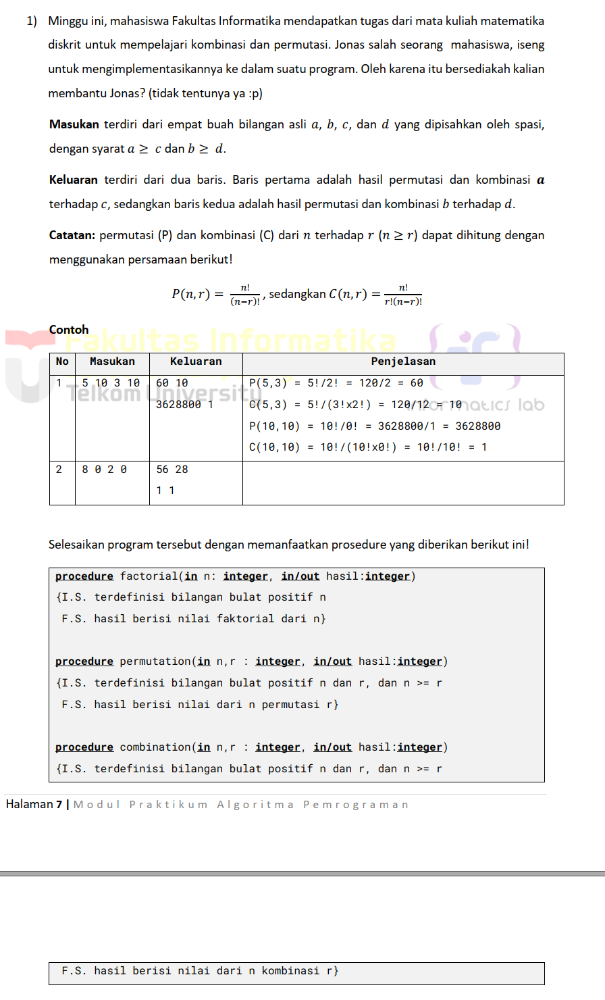
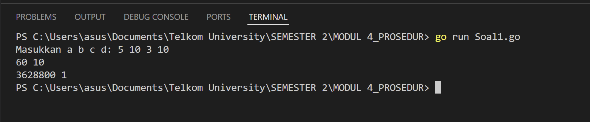
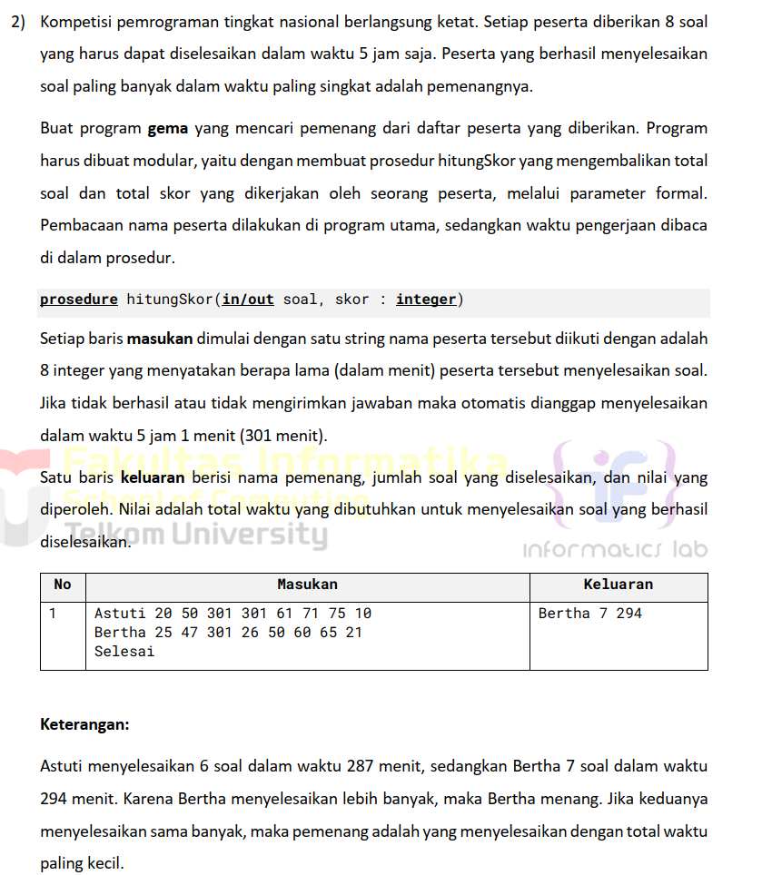
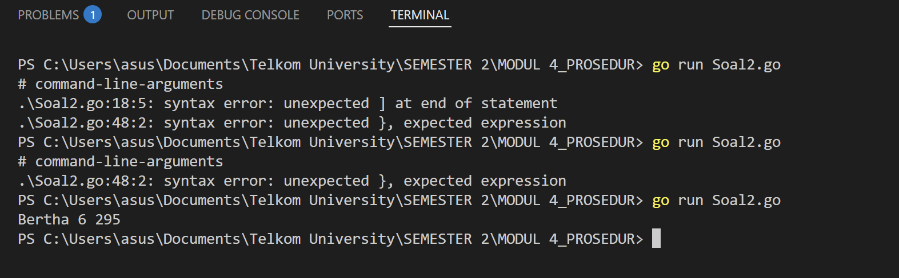
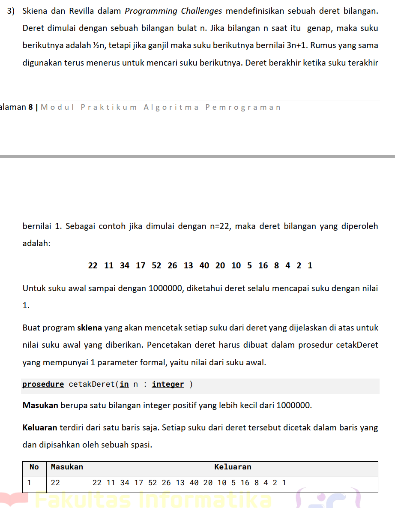
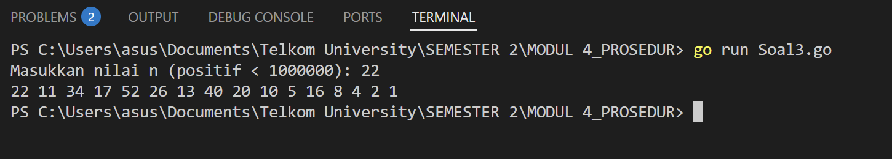

# <h1 align="center">Laporan Praktikum Modul 4 <br> Review Pengenalan Pemrograman</h1>

<p align="center">ANISA KEYZA HUSNUL KHATIMAH - 2211102210</p>

  

## Dasar Teori

Prosedur dapat dianggap sebagai potongan beberapa instruksi program menjadi suatu instruksi baru yang dibuat untuk mengurangi kerumitan dari kode program yang kompleks pada suatu program yang besar. Prosedur akan menghasilkan suatu akibat atau efek langsung pada program ketika dipanggil pada program utama.

## Unguided


### Soal 1

> 

```go
package main

import (
    "fmt"
)

// Fungsi untuk menghitung faktorial dari n
func factorial(n int) int {
    if n == 0 || n == 1 {
        return 1
    }
    return n * factorial(n-1)
}

// Fungsi untuk menghitung permutasi P(n, r) = n! / (n - r)!
func permutation(n, r int) int {
    return factorial(n) / factorial(n-r)
}

// Fungsi untuk menghitung kombinasi C(n, r) = n! / (r! * (n - r)!)
func combination(n, r int) int {
    return factorial(n) / (factorial(r) * factorial(n-r))
}

func main() {
    var a, b, c, d int

    // Input 4 bilangan bulat: a, b, c, d
    fmt.Print("Masukkan a b c d: ")
    fmt.Scan(&a, &b, &c, &d)

    // Baris pertama: hasil dari a terhadap c
    fmt.Println(permutation(a, c), combination(a, c))

    // Baris kedua: hasil dari b terhadap d
    fmt.Println(permutation(b, d), combination(b, d))
}
```

> Output
> 

Program ini dirancang untuk membantu menghitung nilai permutasi dan kombinasi dari dua pasangan bilangan bulat yang dimasukkan oleh pengguna. Sesuai dengan permasalahan pada modul, pengguna diminta untuk memasukkan empat bilangan, yaitu `a`, `b`, `c`, dan `d`, dengan ketentuan bahwa `a ≥ c` dan `b ≥ d`. Setelah data dimasukkan, program akan menghitung dua jenis perhitungan matematis untuk setiap pasangan: permutasi dan kombinasi.

Perhitungan permutasi digunakan untuk menentukan banyaknya susunan berbeda dari `r` elemen yang dipilih dari `n` elemen, sedangkan kombinasi menghitung jumlah cara memilih `r` elemen dari `n` elemen tanpa memperhatikan urutan. Program ini menggunakan fungsi `factorial()` untuk menghitung faktorial bilangan sebagai dasar perhitungan permutasi dan kombinasi.

Hasil akhir ditampilkan dalam dua baris: baris pertama menampilkan hasil permutasi dan kombinasi dari `a` terhadap `c`, sedangkan baris kedua menampilkan hasil yang sama dari `b` terhadap `d`. Dengan pendekatan ini, program memberikan cara sederhana namun efektif untuk memahami penerapan konsep kombinasi dan permutasi dalam pemrograman.


### Soal 2

> 

```go
package main

import (
    "fmt"
    "strings"
)

type Peserta struct {
    Nama  string
    Soal  int
    Waktu int
}

func hitungSkor(input []string) Peserta {
    var pemenang Peserta
    for _, line := range input {
        if line == "Selesai" {
            break
        }
        fields := strings.Fields(line)
        if len(fields) < 2 {
            continue
        }
        nama := fields[0]
        waktuTotal := 0
        jumlahSoal := 0
        for _, waktuStr := range fields[1:] {
            var waktu int
            fmt.Sscanf(waktuStr, "%d", &waktu)
            if waktuTotal+waktu > 301 {
                break
            }
            waktuTotal += waktu
            jumlahSoal++
        }
        if jumlahSoal > pemenang.Soal || (jumlahSoal == pemenang.Soal && waktuTotal < pemenang.Waktu) {
            pemenang = Peserta{Nama: nama, Soal: jumlahSoal, Waktu: waktuTotal}
        }
    }
    return pemenang
}

func main() {
    input := []string{
        "Astuti 20 50 301 61 71 75 10",
        "Bertha 25 47 36 61 66 60 65 21",
        "Selesai",
    }
    pemenang := hitungSkor(input)
    fmt.Printf("%s %d %d\n", pemenang.Nama, pemenang.Soal, pemenang.Waktu)

}
```

> Output
> 

Program ini dirancang untuk menentukan juara dalam suatu kompetisi pemrograman dengan sistem penilaian yang mengutamakan dua faktor utama: jumlah soal yang berhasil diselesaikan dan kecepatan penyelesaian.


### Soal 3

> 

```go
package main

import (
    "fmt"
)

func cetakDeret(n int) {
    for {
        fmt.Print(n, " ")
        if n == 1 {
            break
        }
        if n%2 == 0 {
            n = n / 2
        } else {
            n = 3*n + 1
        }
    }
    fmt.Println()
}

func main() {
    var n int
    fmt.Print("Masukkan nilai n (positif < 1000000): ")
    fmt.Scan(&n)

    if n > 0 && n < 1000000 {
        cetakDeret(n)
    } else {
        fmt.Println("Masukan tidak valid. Harus berupa bilangan bulat positif kurang dari 1000000.")
    }

}
```

> Output
> 

Deret dimulai dari sebuah bilangan bulat positif `n`. Aturannya sederhana: jika `n` genap, maka dilanjutkan dengan `n / 2`; jika ganjil, dilanjutkan dengan `3n + 1`. Proses ini terus berulang hingga nilai `n` mencapai 1.

Program ini diimplementasikan melalui prosedur bernama `cetakDeret`, yang menerima satu parameter berupa nilai awal `n`. Deret dicetak dalam satu baris dengan setiap suku dipisahkan oleh spasi. Input dari pengguna divalidasi agar berada dalam rentang yang sesuai (positif dan kurang dari 1.000.000). Hasil akhirnya adalah deret lengkap yang sesuai dengan pola hingga mencapai nilai 1.