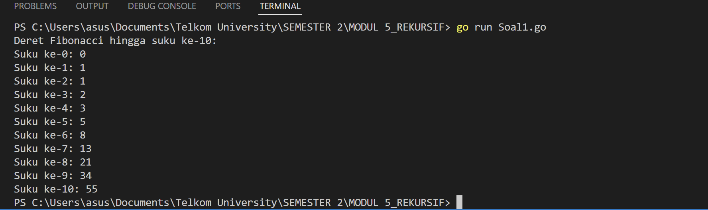
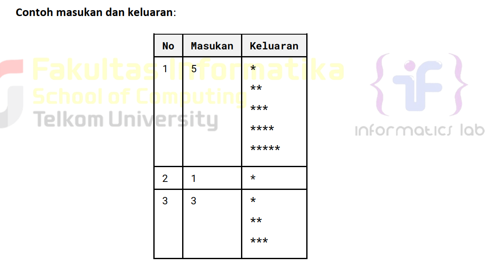
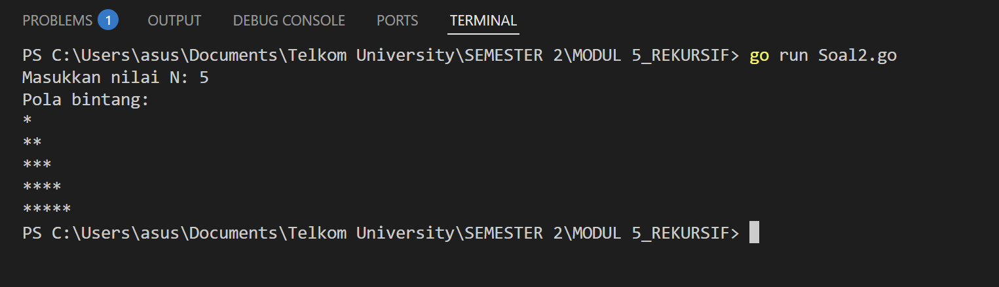
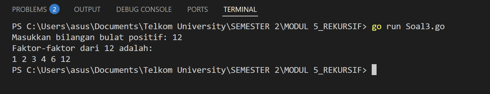
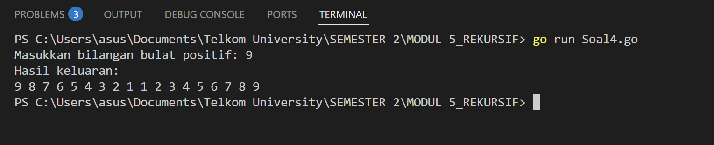
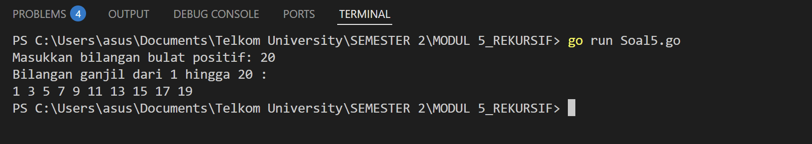
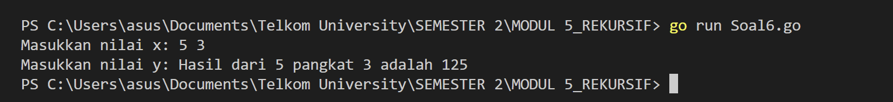

# <h1 align="center">Laporan Praktikum Modul 5 <br> Review Pengenalan Pemrograman</h1>

<p align="center">ANISA KEYZA HUSNUL KHATIMAH - 2211102210</p>

  

## Dasar Teori

Rekursif secara sederhana dapat diartikan sebagai cara menyelesaikan suatu masalah dengan cara  
menyelesaikan sub-masalah yang identik dari masalah utama.

## Unguided


### No. 1

Deret fibonacci adalah sebuah deret dengan nilai suku ke-0 dan ke-1 adalah 0 dan 1, dan nilai  
suku ke-n selanjutnya adalah hasil penjumlahan dua suku sebelumnya. Secara umum dapat  
diformulasikan 𝑆  
𝑛 = 𝑆𝑛-1 + 𝑆𝑛-2 . Berikut ini adalah contoh nilai deret fibonacci hingga suku  
ke-10. Buatlah program yang mengimplementasikan fungsi rekursif pada deret fibonacci  
tersebut.

> 

```go
package main

import (
    "fmt"
)

// Fungsi rekursif untuk menghitung nilai Fibonacci ke-n
func fibonacci(n int) int {
    if n == 0 {
        return 0
    } else if n == 1 {
        return 1
    } else {
        return fibonacci(n-1) + fibonacci(n-2)
    }
}

func main() {
    fmt.Println("Deret Fibonacci hingga suku ke-10:")
    for i := 0; i <= 10; i++ {
        fmt.Printf("Suku ke-%d: %d\n", i, fibonacci(i))
    }
}
```

> Output
> 

Program ini bertujuan untuk menghitung deret Fibonacci hingga suku ke-10 menggunakan pendekatan rekursif.

Di dalam program terdapat sebuah fungsi bernama `fibonacci` yang menerima satu parameter berupa bilangan bulat `n`. Fungsi ini bekerja secara rekursif, yaitu memanggil dirinya sendiri untuk menyelesaikan perhitungan. Pada dasarnya, fungsi ini mengikuti rumus matematis Fibonacci, yaitu setiap suku merupakan hasil penjumlahan dari dua suku sebelumnya. Sebagai dasar, jika nilai `n` adalah 0 maka fungsi akan mengembalikan nilai 0, dan jika `n` adalah 1 maka akan mengembalikan nilai 1. Untuk nilai `n` yang lebih besar dari 1, fungsi akan menghitung `fibonacci(n-1) + fibonacci(n-2)`.

Fungsi utama program (`main`) digunakan untuk menampilkan hasil deret Fibonacci dari suku ke-0 hingga suku ke-10. Hal ini dilakukan dengan perulangan `for` yang berjalan dari nilai 0 sampai 10, kemudian setiap hasil perhitungan dicetak ke layar menggunakan fungsi `fmt.Printf`.

Hasil dari program ini akan mencetak sepuluh nilai pertama dari deret Fibonacci, yaitu: 0, 1, 1, 2, 3, 5, 8, 13, 21, 34, dan 55. Dengan cara ini, program memberikan ilustrasi yang sederhana namun jelas mengenai bagaimana konsep rekursi bekerja dalam menyusun deret Fibonacci di dalam bahasa Go.

### No. 2

Buatlah sebuah program yang digunakan untuk menampilkan pola bintang berikut ini dengan  
menggunakan fungsi rekursif. N adalah masukan dari user.

> 

```go
package main

import (
    "fmt"
)

// Fungsi rekursif untuk mencetak bintang sebanyak n
func printStars(n int) {
    if n == 0 {
        return
    }
    fmt.Print("*")
    printStars(n - 1)
}

// Fungsi rekursif untuk mencetak baris bintang dari 1 sampai n
func printPattern(n int) {
    if n == 0 {
        return
    }
    printPattern(n - 1) // mencetak baris sebelumnya lebih dahulu
    printStars(n)       // mencetak bintang sebanyak nilai n
    fmt.Println()       // pindah ke baris baru
}

func main() {
    var input int
    fmt.Print("Masukkan nilai N: ")
    fmt.Scan(&input)
    fmt.Println("Pola bintang:")
    printPattern(input)
}
```

> Output
> 

Program ini dibuat bertujuan untuk mencetak pola bintang bertingkat ke bawah sesuai jumlah baris yang dimasukkan oleh pengguna. Program ini menggunakan **fungsi rekursif** sebagai metode utama pencetakan, sesuai dengan permintaan soal.

Pertama, program meminta pengguna untuk memasukkan sebuah nilai `N`, yang menentukan jumlah baris dalam pola bintang. Nilai ini kemudian digunakan dalam fungsi rekursif `printPattern`, yang bertugas mencetak setiap baris mulai dari baris pertama hingga baris ke-N.

Fungsi `printPattern` bekerja dari bawah ke atas, memanggil dirinya sendiri dengan nilai `n-1` hingga mencapai nilai 0. Setelah mencapai dasar rekursi (base case), fungsi mulai mencetak satu baris bintang sesuai dengan nilai `n` saat itu. Proses pencetakan bintang dilakukan oleh fungsi rekursif lainnya bernama `printStars`, yang mencetak satu karakter bintang (`*`) dan memanggil dirinya sendiri hingga jumlah bintang sesuai dengan nilai `n`.

Dengan pendekatan ini, pola bintang yang tercetak akan membentuk segitiga siku-siku ke bawah, dimulai dari satu bintang di baris pertama hingga `N` bintang di baris terakhir. Program ini menunjukkan bagaimana rekursi dapat digunakan tidak hanya untuk perhitungan matematis, tetapi juga untuk membangun pola visual secara bertahap.


### No. 3

Buatlah program yang mengimplementasikan rekursif untuk menampilkan faktor bilangan dari  
suatu N, atau bilangan yang apa saja yang habis membagi N.  
Masukan terdiri dari sebuah bilangan bulat positif N.  
Keluaran terdiri dari barisan bilangan yang menjadi faktor dari N (terurut dari 1 hingga N ya).

```go
package main

import (
    "fmt"
)

// Fungsi rekursif untuk mencari dan menampilkan faktor dari N
func printFactors(n int, i int) {
    if i > n {
        return
    }
    if n%i == 0 {
        fmt.Printf("%d ", i)
    }
    printFactors(n, i+1)
}

func main() {
    var n int
    fmt.Print("Masukkan bilangan bulat positif: ")
    fmt.Scan(&n)
    fmt.Println("Faktor-faktor dari", n, "adalah:")
    printFactors(n, 1)
}
```

> Output
> 

Program ini bertujuan untuk menampilkan semua faktor dari suatu bilangan bulat positif yang dimasukkan oleh pengguna. Faktor adalah bilangan yang habis membagi bilangan tersebut tanpa sisa.

Setelah pengguna memasukkan nilai `N`, program akan memanggil fungsi rekursif bernama `printFactors`. Fungsi ini menerima dua parameter, yaitu nilai `N` dan `i` sebagai bilangan pembagi yang dimulai dari 1. Fungsi ini akan terus berjalan hingga `i` melebihi `N`.

Di dalam fungsi, setiap bilangan `i` akan dicek apakah habis membagi `N` (`n % i == 0`). Jika ya, maka `i` dicetak sebagai salah satu faktor dari `N`. Setelah itu, fungsi memanggil dirinya sendiri dengan `i + 1`, sehingga proses pencetakan berlanjut ke angka berikutnya.

Dengan pendekatan rekursif ini, program dapat mencetak seluruh faktor dari bilangan `N` secara terurut dari 1 hingga `N`.


### No. 4

Buatlah program yang mengimplementasikan rekursif untuk menampilkan barisan bilangan  
tertentu.  
Masukan terdiri dari sebuah bilangan bulat positif N.  
Keluaran terdiri dari barisan bilangan dari N hingga 1 dan kembali ke N.

```go
package main

import (
    "fmt"
)

// Fungsi rekursif untuk mencetak bilangan dari N ke 1 lalu kembali ke N
func printSequence(n int) {
    if n == 0 {
        return
    }

    // Cetak saat turun
    fmt.Printf("%d ", n)

    // Rekursi ke bawah
    printSequence(n - 1)

    // Cetak saat naik
    fmt.Printf("%d ", n)
}

func main() {
    var n int
    fmt.Print("Masukkan bilangan bulat positif: ")
    fmt.Scan(&n)
    fmt.Println("Hasil keluaran:")
    printSequence(n)
}
```

> Output
> 

Program ini bertujuan untuk menampilkan barisan bilangan dari suatu nilai `N` hingga 1, lalu kembali naik hingga `N` kembali, menggunakan pendekatan rekursif.

Setelah pengguna memasukkan bilangan bulat positif `N`, program memanggil fungsi rekursif `printSequence`. Fungsi ini pertama-tama mencetak nilai `N`, lalu memanggil dirinya sendiri dengan `N - 1`, hingga mencapai nilai 0 sebagai kondisi berhenti. Setelah mencapai titik dasar ini, fungsi kembali naik dan mencetak kembali nilai `N` saat proses rekursi kembali.

Dengan cara ini, program mencetak angka secara menurun dari `N` ke 1, lalu secara menaik dari 1 ke `N`.

### No. 5

Buatlah program yang mengimplementasikan rekursif untuk menampilkan barisan bilangan ganjil.  
Masukan terdiri dari sebuah bilangan bulat positif N.  
Keluaran terdiri dari barisan bilangan ganjil dari 1 hingga N.

```go
package main

import (
    "fmt"
)

// Fungsi rekursif untuk mencetak bilangan ganjil dari 1 hingga n
func printOdd(n int, current int) {
    if current > n {
        return
    }
    if current%2 != 0 {
        fmt.Print(current, " ")
    }
    printOdd(n, current+1)
}

func main() {
    var n int
    fmt.Print("Masukkan bilangan bulat positif: ")
    fmt.Scan(&n)
    fmt.Println("Bilangan ganjil dari 1 hingga", n, ":")
    printOdd(n, 1)
}
```

> Output
> 

Program ini bertujuan untuk menampilkan deret bilangan ganjil dari 1 hingga N menggunakan pendekatan rekursif. Setelah pengguna memasukkan nilai `N`, program memanggil fungsi `printOdd`, dimulai dari angka 1. Fungsi ini akan memeriksa apakah angka saat ini adalah bilangan ganjil dan mencetaknya jika ya, lalu memanggil dirinya sendiri dengan menambah angka satu per satu hingga mencapai nilai `N`. Dengan cara ini, deret ganjil ditampilkan secara berurutan hingga nilai maksimum yang diberikan oleh pengguna.

### No. 6

Buatlah program yang mengimplementasikan rekursif untuk mencari hasil pangkat dari dua  
buah bilangan.  
Masukan terdiri dari bilangan bulat x dan y.  
Keluaran terdiri dari hasil x dipangkatkan y.  
Catatan: diperbolehkan menggunakan asterik "*", tapi dilarang menggunakan import "math"

```go
package main

import (
    "fmt"
)

// Fungsi rekursif untuk menghitung x pangkat y
func power(x int, y int) int {
    if y == 0 {
        return 1
    }
    return x * power(x, y-1)
}

func main() {
    var x, y int
    fmt.Print("Masukkan nilai x: ")
    fmt.Scan(&x)
    fmt.Print("Masukkan nilai y: ")
    fmt.Scan(&y)
    hasil := power(x, y)
    fmt.Printf("Hasil dari %d pangkat %d adalah %d\n", x, y, hasil)
}
```

> Output
> 

Program ini dibuat untuk menghitung hasil pemangkatan dua bilangan bulat menggunakan pendekatan rekursif.

Di dalam program, saya membuat sebuah fungsi bernama `power` yang menerima dua parameter: `x` sebagai basis dan `y` sebagai eksponen. Fungsi ini akan memanggil dirinya sendiri secara berulang dengan mengurangi nilai `y` hingga mencapai nol. Ketika `y` sama dengan nol, fungsi akan mengembalikan nilai 1 sebagai kondisi dasar (karena bilangan apa pun pangkat nol hasilnya adalah 1). Setiap langkah rekursi akan mengalikan `x` dengan hasil panggilan fungsi sebelumnya, sehingga membentuk perhitungan seperti `x * x * ... * x` sebanyak `y` kali.

Dalam fungsi `main`, pengguna diminta untuk memasukkan nilai `x` dan `y`. Program kemudian memanggil fungsi `power` dan menampilkan hasil akhirnya ke layar.