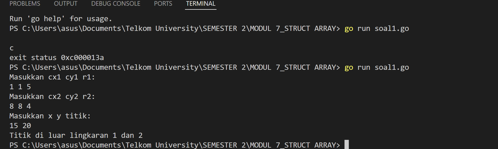
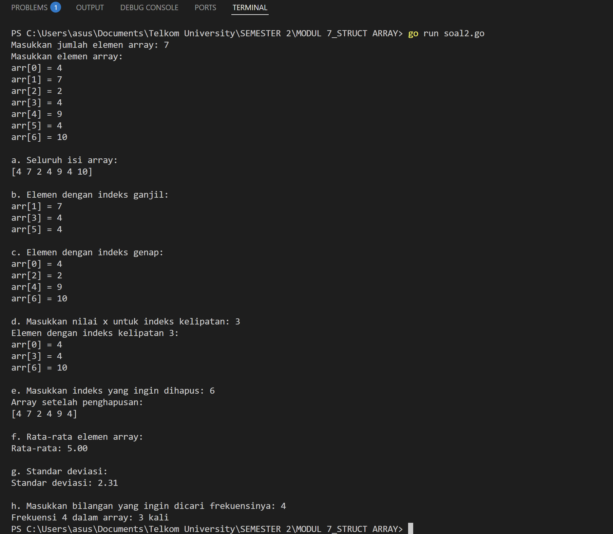
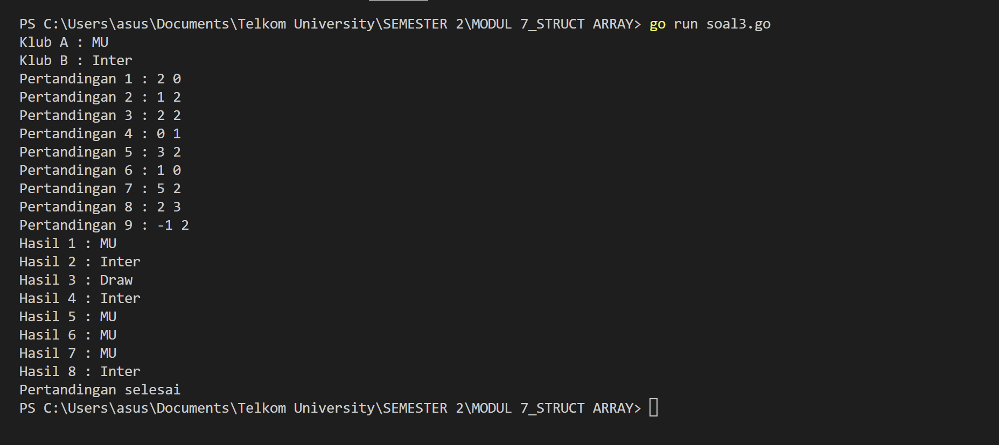
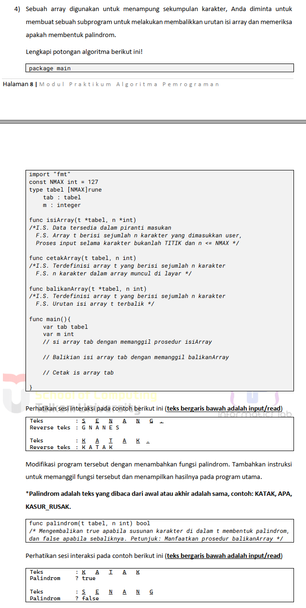
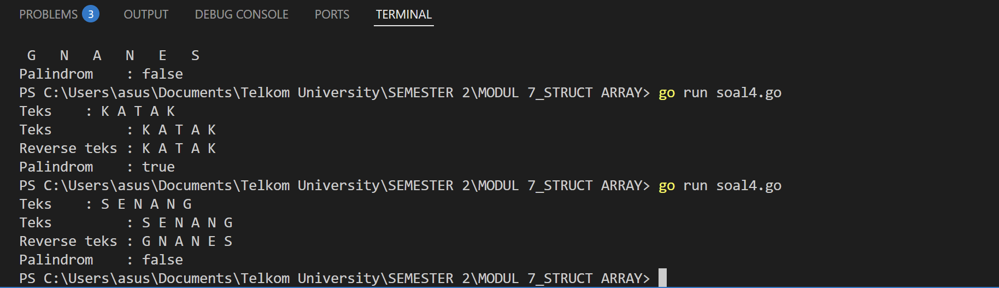

# <h1 align="center">Laporan Praktikum Modul 7 <br> Struct Array</h1>

<p align="center">ANISA KEYZA HUSNUL KHATIMAH - 2211102210</p>

  

## Dasar Teori

Struct (struktur) adalah tipe data bentukan yang digunakan untuk **mengelompokkan berbagai data dengan tipe berbeda** menjadi satu entitas atau objek. Sedangkan array adalah kumpulan **elemen-elemen bertipe data sama** yang disimpan dalam satu variabel dan diakses menggunakan **indeks** (mulai dari 0).

## Unguided


### No. 1

Suatu lingkaran didefinisikan dengan koordinat titik pusat (𝑐𝑥, 𝑐𝑦) dengan radius 𝑟. Apabila  
diberikan dua buah lingkaran, maka tentukan posisi sebuah titik sembarang (𝑥, 𝑦)  
berdasarkan dua lingkaran tersebut. Gunakan tipe bentukan titik untuk menyimpan  
koordinat, dan tipe bentukan lingkaran untuk menyimpan titik pusat lingkaran dan  
radiusnya.  
Masukan terdiri dari beberapa tiga baris. Baris pertama dan kedua adalah koordinat titik pusat  
dan radius dari lingkaran 1 dan lingkaran 2, sedangkan baris ketiga adalah koordinat titik  
sembarang. Asumsi sumbu x dan y dari semua titik dan juga radius direpresentasikan dengan  
bilangan bulat.  
Keluaran berupa string yang menyatakan posisi titik "Titik di dalam lingkaran 1 dan 2", "Titik  
di dalam lingkaran 1", "Titik di dalam lingkaran 2", atau "Titik di luar lingkaran 1 dan 2".  

```go
package main

import (
    "fmt"
    "math"
)

// Struct untuk titik
type Titik struct {
    x int
    y int
}

// Struct untuk lingkaran
type Lingkaran struct {
    titikPusat Titik
    radius     int
}

// Fungsi menghitung jarak antara dua titik
func jarak(p, q Titik) float64 {
    return math.Sqrt(math.Pow(float64(p.x-q.x), 2) + math.Pow(float64(p.y-q.y), 2))
}

// Fungsi mengecek apakah titik ada di dalam lingkaran
func diDalam(c Lingkaran, p Titik) bool {
    return jarak(c.titikPusat, p) <= float64(c.radius)
}

func main() {
    // Deklarasi variabel input
    var cx1, cy1, r1 int
    var cx2, cy2, r2 int
    var x, y int

    // Input data
    fmt.Println("Masukkan cx1 cy1 r1:")
    fmt.Scan(&cx1, &cy1, &r1)
    fmt.Println("Masukkan cx2 cy2 r2:")
    fmt.Scan(&cx2, &cy2, &r2)
    fmt.Println("Masukkan x y titik:")
    fmt.Scan(&x, &y)

    // Buat objek lingkaran dan titik
    ling1 := Lingkaran{Titik{cx1, cy1}, r1}
    ling2 := Lingkaran{Titik{cx2, cy2}, r2}
    titik := Titik{x, y}

    // Logika pengecekan
    diLing1 := diDalam(ling1, titik)
    diLing2 := diDalam(ling2, titik)

    // Output hasil
    if diLing1 && diLing2 {
        fmt.Println("Titik di dalam lingkaran 1 dan 2")
    } else if diLing1 {
        fmt.Println("Titik di dalam lingkaran 1")
    } else if diLing2 {
        fmt.Println("Titik di dalam lingkaran 2")
    } else {
        fmt.Println("Titik di luar lingkaran 1 dan 2")
    }
}
```

> Output
> 

Dalam program ini, saya membangun sebuah logika sederhana untuk menentukan posisi suatu titik terhadap dua buah lingkaran. Setiap lingkaran didefinisikan oleh titik pusat dan jari-jari, sedangkan titik yang ingin diperiksa didefinisikan oleh koordinat x dan y.

Untuk merepresentasikan konsep ini secara terstruktur, saya menggunakan dua buah `struct`: satu bernama `Titik`, yang menyimpan koordinat x dan y, dan satu lagi bernama `Lingkaran`, yang menyimpan titik pusat (bertipe `Titik`) dan nilai radius.

Langkah pertama program dimulai dengan meminta pengguna untuk memasukkan data lingkaran pertama, lingkaran kedua, dan titik yang akan diperiksa. Setelah semua input diterima, program menggunakan fungsi `jarak()` untuk menghitung jarak Euclidean antara titik pusat lingkaran dan titik acak tersebut. Rumus yang digunakan adalah akar kuadrat dari jumlah kuadrat selisih x dan selisih y.

Setelah jarak dihitung, fungsi `diDalam()` akan mengevaluasi apakah titik tersebut berada di dalam lingkaran, yaitu jika jaraknya lebih kecil atau sama dengan jari-jari lingkaran.

Terakhir, program akan mencetak hasil berupa informasi apakah titik tersebut:
- berada di dalam lingkaran 1,
- berada di dalam lingkaran 2,
- berada di dalam keduanya,
- atau bahkan di luar kedua lingkaran.

Dengan menggunakan pendekatan terstruktur ini, program dapat mengevaluasi posisi titik terhadap dua lingkaran secara efisien dan mudah dibaca.


### No. 2

Sebuah array digunakan untuk menampung sekumpulan bilangan bulat. Buatlah program  
yang digunakan untuk mengisi array tersebut sebanyak N elemen nilai. Asumsikan array  
memiliki kapasitas penyimpanan data sejumlah elemen tertentu. Program dapat  
menampilkan beberapa informasi berikut:  
a. Menampilkan keseluruhan isi dari array.  
b. Menampilkan elemen-elemen array dengan indeks ganjil saja.  
c. Menampilkan elemen-elemen array dengan indeks genap saja (asumsi indek ke-0 adalah  
genap).  
d. Menampilkan elemen-elemen array dengan indeks kelipatan bilangan x. x bisa diperoleh  
dari masukan pengguna.  
e. Menghapus elemen array pada indeks tertentu, asumsi indeks yang hapus selalu valid.  
Tampilkan keseluruhan isi dari arraynya, pastikan data yang dihapus tidak tampil  
f. Menampilkan rata-rata dari bilangan yang ada di dalam array.  
g. Menampilkan standar deviasi atau simpangan baku dari bilangan yang ada di dalam array  
tersebut.  
h. Menampilkan frekuensi dari suatu bilangan tertentu di dalam array yang telah diisi  
tersebut.

```go
package main

import (
    "fmt"
    "math"
)

func main() {
    var n int
    fmt.Print("Masukkan jumlah elemen array: ")
    fmt.Scan(&n)
    arr := make([]int, n)
    fmt.Println("Masukkan elemen array:")
    for i := 0; i < n; i++ {
        fmt.Printf("arr[%d] = ", i)
        fmt.Scan(&arr[i])
    }

    // a. Tampilkan keseluruhan isi array
    fmt.Println("\na. Seluruh isi array:")
    fmt.Println(arr)

    // b. Tampilkan elemen indeks ganjil
    fmt.Println("\nb. Elemen dengan indeks ganjil:")
    for i := 1; i < len(arr); i += 2 {
        fmt.Printf("arr[%d] = %d\n", i, arr[i])
    }

    // c. Tampilkan elemen indeks genap
    fmt.Println("\nc. Elemen dengan indeks genap:")
    for i := 0; i < len(arr); i += 2 {
        fmt.Printf("arr[%d] = %d\n", i, arr[i])
    }

    // d. Tampilkan elemen dengan indeks kelipatan x
    var x int
    fmt.Print("\nd. Masukkan nilai x untuk indeks kelipatan: ")
    fmt.Scan(&x)
    fmt.Printf("Elemen dengan indeks kelipatan %d:\n", x)
    for i := 0; i < len(arr); i++ {
        if i%x == 0 {
            fmt.Printf("arr[%d] = %d\n", i, arr[i])
        }
    }

    // e. Hapus elemen pada indeks tertentu
    var delIdx int
    fmt.Print("\ne. Masukkan indeks yang ingin dihapus: ")
    fmt.Scan(&delIdx)
    if delIdx >= 0 && delIdx < len(arr) {
        arr = append(arr[:delIdx], arr[delIdx+1:]...)
        fmt.Println("Array setelah penghapusan:")
        fmt.Println(arr)
    } else {
        fmt.Println("Indeks tidak valid.")
    }

    // f. Hitung rata-rata
    fmt.Println("\nf. Rata-rata elemen array:")
    sum := 0
    for _, val := range arr {
        sum += val
    }
    rata := float64(sum) / float64(len(arr))
    fmt.Printf("Rata-rata: %.2f\n", rata)

    // g. Hitung standar deviasi
    fmt.Println("\ng. Standar deviasi:")
    var sd float64
    for _, val := range arr {
        sd += math.Pow(float64(val)-rata, 2)
    }
    sd = math.Sqrt(sd / float64(len(arr)))
    fmt.Printf("Standar deviasi: %.2f\n", sd)

    // h. Hitung frekuensi bilangan tertentu
    var cari int
    fmt.Print("\nh. Masukkan bilangan yang ingin dicari frekuensinya: ")
    fmt.Scan(&cari)
    freq := 0
    for _, val := range arr {
        if val == cari {
            freq++
        }
    }
    fmt.Printf("Frekuensi %d dalam array: %d kali\n", cari, freq)
}
```

> Output
> 

Setelah program dijalankan, pengguna diminta untuk memasukkan jumlah elemen array, kemudian memasukkan nilai-nilai elemen tersebut satu per satu sesuai jumlah yang diminta. Setelah seluruh elemen berhasil dimasukkan, program menampilkan isi array secara lengkap sebagai konfirmasi input data.

Selanjutnya, program menampilkan elemen-elemen yang berada pada indeks ganjil dan indeks genap secara terpisah. Hal ini memudahkan pengguna untuk melihat distribusi data berdasarkan posisi indeksnya.

Kemudian, program meminta pengguna memasukkan sebuah nilai `x`. Program akan menampilkan elemen-elemen yang memiliki indeks kelipatan dari nilai `x` tersebut, sehingga pengguna dapat melihat elemen-elemen yang terpilih berdasarkan kriteria kelipatan indeks.

Setelah itu, pengguna diminta memasukkan indeks elemen yang ingin dihapus dari array. Program akan menghapus elemen pada indeks tersebut dan menampilkan array yang sudah diperbarui sebagai hasil modifikasi data.

Selanjutnya, program menghitung dan menampilkan rata-rata dari seluruh elemen array setelah penghapusan. Rata-rata ini memberikan gambaran nilai tengah dari data yang tersisa.

Program kemudian menghitung standar deviasi dari elemen-elemen array sebagai ukuran sebaran data terhadap rata-rata. Nilai standar deviasi ini membantu dalam memahami variabilitas data.

Terakhir, program meminta pengguna memasukkan sebuah nilai untuk dicari frekuensi kemunculannya dalam array. Program kemudian menampilkan berapa kali nilai tersebut muncul, memberikan informasi tentang distribusi kemunculan nilai spesifik dalam data.

Dengan rangkaian output tersebut, program memberikan fungsi dasar analisis data array, mulai dari tampilan data, modifikasi, hingga penghitungan statistik dasar yang berguna untuk memahami karakteristik data secara keseluruhan.


### No. 3

Sebuah program digunakan untuk menyimpan dan menampilkan nama-nama klub yang  
memenangkan pertandingan bola pada suatu grup pertandingan. Buatlah program yang  
digunakan untuk merekap skor pertandingan bola 2 buah klub bola yang berlaga.  
Pertama-tama program meminta masukan nama-nama klub yang bertanding, kemudian  
program meminta masukan skor hasil pertandingan kedua klub tersebut. Yang disimpan  
dalam array adalah nama-nama klub yang menang saja.  
Proses input skor berhenti ketika skor salah satu atau kedua klub tidak valid (negatif). Di akhir  
program, tampilkan daftar klub yang memenangkan pertandingan.

```go
package main

import (
    "bufio"
    "fmt"
    "os"
    "strconv"
    "strings"
)

func main() {
    var klubA, klubB string
    var pemenang []string
    scanner := bufio.NewScanner(os.Stdin)

    // Input nama klub
    fmt.Print("Klub A : ")
    scanner.Scan()
    klubA = scanner.Text()
    fmt.Print("Klub B : ")
    scanner.Scan()
    klubB = scanner.Text()
    pertandingan := 1
    for {
        fmt.Printf("Pertandingan %d : ", pertandingan)
        scanner.Scan()
        input := scanner.Text()

        // Parsing skor dari input, misalnya: "2 1"
        scores := strings.Fields(input)
        if len(scores) != 2 {
            fmt.Println("Input tidak valid. Masukkan 2 angka.")
            continue
        }
        skorA, err1 := strconv.Atoi(scores[0])
        skorB, err2 := strconv.Atoi(scores[1])

        // Cek apakah skor valid
        if err1 != nil || err2 != nil || skorA < 0 || skorB < 0 {
            break
        }

        // Menentukan pemenang
        if skorA > skorB {
            pemenang = append(pemenang, klubA)
        } else if skorA < skorB {
            pemenang = append(pemenang, klubB)
        } else {
            pemenang = append(pemenang, "Draw")
        }
        pertandingan++
    }

    // Menampilkan hasil pertandingan
    for i, hasil := range pemenang {
        fmt.Printf("Hasil %d : %s\n", i+1, hasil)
    }
    fmt.Println("Pertandingan selesai")

}
```

> Output
> 

Program ini dibuat untuk mencatat dan menampilkan hasil pertandingan sepak bola antara dua klub. Pada awalnya, program meminta pengguna untuk memasukkan nama dua klub yang akan bertanding. Selanjutnya, pengguna diminta untuk memasukkan skor dari setiap pertandingan secara berurutan.

Setiap input skor terdiri dari dua angka yang mewakili jumlah gol masing-masing klub. Program akan memproses skor tersebut dan menentukan klub mana yang menang. Jika skor sama, maka hasil pertandingan dicatat sebagai "Draw". Nama klub yang menang (atau "Draw") disimpan dalam daftar.

Proses input skor akan terus berjalan sampai pengguna memasukkan skor yang tidak valid (yaitu skor negatif atau bukan angka). Setelah proses selesai, program akan menampilkan hasil dari setiap pertandingan secara berurutan berdasarkan data yang telah dimasukkan.

Dengan cara ini, pengguna bisa dengan mudah merekap dan melihat siapa saja pemenang dari serangkaian pertandingan yang telah dimainkan.


### No. 4

> 

```go
package main

import (
    "bufio"
    "fmt"
    "os"
    "unicode"
)

const NMAX int = 127

type tabel [NMAX]rune

func isiArray(t *tabel, n *int) {
    reader := bufio.NewReader(os.Stdin)
    *n = 0

    fmt.Print("Teks    : ")
    input, _ := reader.ReadString('\n') // Baca satu baris teks

    for _, ch := range input {
        if ch == '.' || *n >= NMAX {
            break
        }
        if unicode.IsSpace(ch) {
            continue // Abaikan spasi
        }
        t[*n] = ch
        *n++
    }
}

func cetakArray(t tabel, n int) {
    fmt.Print("Reverse teks : ")
    for i := 0; i < n; i++ {
        fmt.Printf("%c ", t[i])
    }
    fmt.Println()
}

func balikanArray(t *tabel, n int) {
    for i := 0; i < n/2; i++ {
        t[i], t[n-1-i] = t[n-1-i], t[i]
    }
}

func palindrom(t tabel, n int) bool {
    for i := 0; i < n/2; i++ {
        if t[i] != t[n-1-i] {
            return false
        }
    }
    return true
}

func main() {
    var tab tabel
    var n int

    // Input karakter
    isiArray(&tab, &n)

    // Cetak teks asli
    fmt.Print("Teks         : ")
    for i := 0; i < n; i++ {
        fmt.Printf("%c ", tab[i])
    }
    fmt.Println()

    // Cetak teks hasil reverse
    var reversed tabel
    copy(reversed[:], tab[:n])
    balikanArray(&reversed, n)
    cetakArray(reversed, n)

    // Cek palindrom
    if palindrom(tab, n) {
        fmt.Println("Palindrom    : true")
    } else {
        fmt.Println("Palindrom    : false")
    }
}
```

> Output
> 

Program ini digunakan untuk memproses sekumpulan karakter yang dimasukkan oleh pengguna dan mengecek apakah karakter tersebut membentuk **palindrom**. Palindrom adalah susunan karakter yang sama jika dibaca dari depan maupun dari belakang, seperti "KATAK" atau "APA".

Pertama, program meminta pengguna untuk memasukkan teks berupa karakter-karakter (huruf) yang diakhiri dengan tanda titik (`.`). Input dibaca satu baris penuh, lalu diproses satu per satu karakter. Spasi akan diabaikan, sehingga hanya huruf yang disimpan dalam array.

Setelah input selesai, program akan menampilkan teks asli dan membalik isi array untuk ditampilkan sebagai teks terbalik. Kemudian, program mengecek apakah isi array sama dengan versi terbaliknya. Jika sama, maka teks tersebut adalah palindrom dan program akan menampilkan `true`; jika tidak, akan ditampilkan `false`.
